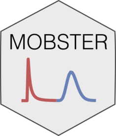

# mobster <a href='https://caravagn.github.io/mobster'></a>

<!-- badges: start -->

[](https://travis-ci.org/caravagn/mobster)
[](https://travis-ci.org/caravagn/mobster)
[](https://www.tidyverse.org/lifecycle/#maturing)
[](https://caravagn.github.io/evoverse)
<!-- badges: end -->

`mobster` is a package that implements a model-based approach for
*subclonal deconvolution* of cancer genome sequencing data ([Caravagna
et al;
PMID: 32879509](https://www.nature.com/articles/s41588-020-0675-5#:~:text=Subclonal%20reconstruction%20methods%20based%20on,and%20infer%20their%20evolutionary%20history.&text=We%20present%20a%20novel%20approach,learning%20with%20theoretical%20population%20genetics.)).

The package integrates evolutionary theory (i.e., population) and
Machine-Learning to analyze (e.g., whole-genome) bulk data from cancer
samples. This analysis relates to clustering; we approach it via a
maximum-likelihood formulation of Dirichlet mixture models, and use
bootstrap routines to assess the confidence of the parameters. The
package implements S3 objects to visualize the data and the fits.

`mobster` is part of the `evoverse` set of [R
packages](https://caravagn.github.io/evoverse) to implement Cancer
Evolution
analyses.

#### Citation

[](https://doi.org/10.1038/s41588-020-0675-5)

If you use `mobster`, please cite:

  - G. Caravagna, T. Heide, M.J. Williams, L. Zapata, D. Nichol, K.
    Chkhaidze, W. Cross, G.D. Cresswell, B. Werner, A. Acar, L. Chesler,
    C.P. Barnes, G. Sanguinetti, T.A. Graham, A. Sottoriva. Subclonal
    reconstruction of tumors by using machine learning and population
    genetics. Nature Genetics 52, 898–907
(2020).

#### Help and support

[](https://caravagn.github.io/mobster)

### Installation

You can install the released version of `mobster` from
[GitHub](https://github.com/) with:

``` r
# install.packages("devtools")
devtools::install_github("caravagn/mobster")
```

-----

#### Copyright and contacts

Giulio Caravagna, PhD. *Institute of Cancer Research, London,
UK*.

[](mailto:gcaravagn@gmail.com)
[](https://github.com/caravagn)
[](https://twitter.com/gcaravagna)
[](https://sites.google.com/site/giuliocaravagna/)
