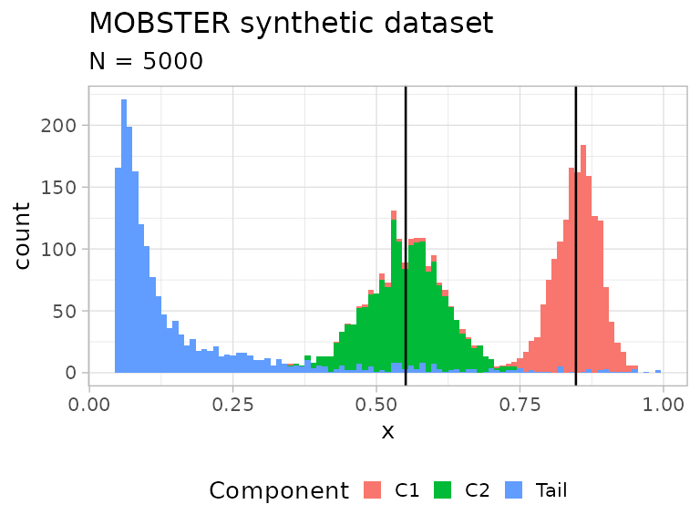
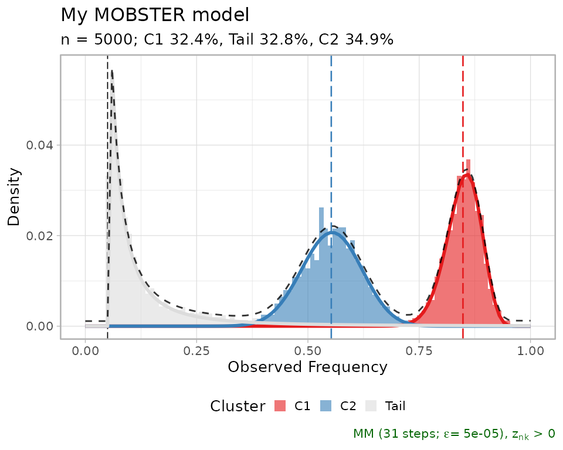
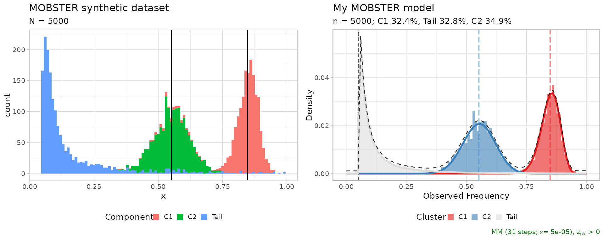

# 1. Introduction

``` r
library(mobster)
library(tidyr)
library(dplyr)
```

## Input data for `mobster`

You can run a MOBSTER analysis if, for a set of input mutations (SNVs,
indels etc.), you have available VAF or CCF data. The input data can be
loaded using different input formats.

For VAF values you can use:

- a `data.frame` (or, `tibble`) with a column named `VAF` whose values
  are numerical $0 < x < 1$, without `NA` entries and columns named any
  of those: `cluster`, `Tail`, `C1`, `C2`, `C3`,…;
- a VCF file that must contain at least a column with the total depth of
  sequencing and the number of reads with the variants. In this case you
  need first to use function `load_VCF` and load the VCF content, and
  then proceed using your data as a `data.frame`.

For CCF values you can only use the a `data.frame` format. Importantly,
you have to store the CCF values in a column again named `VAF`, which
must follow the same convention of a VAF column (i.e., range of values).
Since CCF values usually peak at around `1.0` for clonal mutations
(i.e., present in 100% of the input cells), we suggest to adjust
standard CCF estimates dividing them by `0.5` in order to reflect the
peak of an *heterozygous clonal mutation* at 50% VAF for a 100% pure
bulk sample.

**Example dataset**. Diploid mutations from sample `LU4` of the
[Comprehensive Omics Archive of Lung
Adenocarcinoma](http://genome.kaist.ac.kr/) are available in the package
under the name `LU4_lung_sample`. The available object is the results of
an analysis with `mobster`, and the input mutation data is stored inside
the object.

``` r
# Example dataset LU4_lung_sample, downloaded from http://genome.kaist.ac.kr/
print(mobster::LU4_lung_sample$best$data)
#> # A tibble: 1,282 × 12
#>      Key Callers     t_alt_count t_ref_count Variant_Classification    DP    VAF
#>    <int> <chr>             <int>       <int> <chr>                  <int>  <dbl>
#>  1   370 mutect,str…          30          95 intergenic               125 0.24  
#>  2   371 mutect,str…          10         105 intergenic               115 0.0870
#>  3   372 mutect,str…          40         108 intronic                 148 0.270 
#>  4   373 mutect,str…          20         101 intronic                 121 0.165 
#>  5   374 mutect,str…          39          89 intergenic               128 0.305 
#>  6   375 mutect,str…          41         120 intronic                 161 0.255 
#>  7   376 mutect,str…          43          93 intronic                 136 0.316 
#>  8   377 mutect,str…          22          95 intergenic               117 0.188 
#>  9   378 mutect                7         104 intergenic               111 0.0631
#> 10   379 mutect,str…          35          93 intergenic               128 0.273 
#> # ℹ 1,272 more rows
#> # ℹ 5 more variables: chr <chr>, from <chr>, ref <chr>, alt <chr>,
#> #   cluster <chr>
```

Other datasets are available through the `data` command.

### Driver annotations

In the context of subclonal deconvolution we are often interested in
linking “driver” events to clonal expansions. Since `mobster` works with
somatic mutations data, it is possible to annotate the status of “driver
mutation” in the input data; doing so, the drivers will be reported in
some visualisations of the tool, but will not influence any of the
computation carried out in `mobster`.

The annotate one or more *driver mutations* you need to include in your
column 2 extra columns:

- `is_driver`, a boolean `TRUE/FALSE` flag;
- `driver_label`, a character string that will be used as label in any
  visualisation that uses drivers.

## Generating random models and data

You can sample a random dataset with the `random_dataset` function,
setting:

- the number of mutations (`n`) and Beta components (`k`, subclones) to
  generate;
- ranges and constraints on the size of the components;
- ranges for the mean and variance of the Beta components.

The variance of the Betas is defined as $u/B$ where
$u \sim U\lbrack 0,1\rbrack$, and $B$ is the input parameter
`Beta_variance_scaling`. Roughly, values of `Beta_variance_scaling` on
the order of `1000` give low variance and sharp peaked data
distributions. Values on the order of `100` give much wider
distributions.

``` r
dataset = random_dataset(
  seed = 123456789, 
  Beta_variance_scaling = 100    # variance ~ U[0, 1]/Beta_variance_scaling
  )
```

A list with 3 components is returned, which contains the actual data,
sampled parameters of the generative model, and a plot of the data.

In `mobster` we provide the implementation of the model’s density
function (`ddbpmm`, density Dirichlet Beta Pareto mixture model), and a
sampler (`rdbpmm`) which is used internally by `random_dataset` to
generate the data.

``` r
# Data, in the MOBSTER input format with a "VAF" column.
print(dataset$data)
#> # A tibble: 5,000 × 2
#>      VAF simulated_cluster
#>    <dbl> <chr>            
#>  1 0.856 C1               
#>  2 0.853 C1               
#>  3 0.844 C1               
#>  4 0.827 C1               
#>  5 0.855 C1               
#>  6 0.854 C1               
#>  7 0.878 C1               
#>  8 0.865 C1               
#>  9 0.845 C1               
#> 10 0.874 C1               
#> # ℹ 4,990 more rows

# The generated model contains the parameters of the Beta components (a and b),
# the shape and scale of the tail, and the mixing proportion. 
print(dataset$model)
#> $a
#>      C1      C2 
#> 72.6286 30.5932 
#> 
#> $b
#>       C1       C2 
#> 13.07363 24.93900 
#> 
#> $shape
#> [1] 1
#> 
#> $scale
#> [1] 0.05
#> 
#> $pi
#>      Tail        C1        C2 
#> 0.3431634 0.3331162 0.3237204

# A plot object (ggplot) is available where each data-point is coloured by 
# its generative mixture component. The vertical lines annontate the means of
# the sampled Beta distributions.
print(dataset$plot)
```



## Fitting a dataset

Function `mobster_fit` fits a MOBSTER model.

The function implements a model-selection routine that by default scores
models by their `reICL` (*reduced Integrative Classification
Likelihood*) score, a variant to the popular `BIC` that uses the entropy
of the latent variables of the mixture. `reICL` is discussed in the main
paper.

This function has several parameters to customize the fitting procedure,
and a set of special pre-parametrised runs that can be activated with
parameter `auto_setup`. Here we use `auto_setup = "FAST"`, an automatic
setup for a fast run; its parameters are accessible through an internal
package function.

``` r
# Hidden function (:::)
mobster:::template_parameters_fast_setup()
#> $K
#> [1] 1 2
#> 
#> $samples
#> [1] 2
#> 
#> $init
#> [1] "random"
#> 
#> $tail
#> [1]  TRUE FALSE
#> 
#> $epsilon
#> [1] 1e-06
#> 
#> $maxIter
#> [1] 100
#> 
#> $fit.type
#> [1] "MM"
#> 
#> $seed
#> [1] 12345
#> 
#> $model.selection
#> [1] "reICL"
#> 
#> $trace
#> [1] FALSE
#> 
#> $parallel
#> [1] FALSE
#> 
#> $pi_cutoff
#> [1] 0.02
#> 
#> $N_cutoff
#> [1] 10
```

Compared to these, default parameters test more extensive types of fits
(i.e., more clones, longer fits, higher number of replicates etc.). We
usually use the fast parametrisation to obtain a first fit of the data
and, if not satisfied, we run customised calls of `mobster_fit`.

``` r
# Fast run with auto_setup = "FAST"
fit = mobster_fit(
  dataset$data,    
  auto_setup = "FAST"
  )
#>  [ MOBSTER fit ] 
#> 
#> ✔ Loaded input data, n = 5000.
#> ❯ n = 5000. Mixture with k = 1,2 Beta(s). Pareto tail: TRUE and FALSE. Output
#> clusters with π > 0.02 and n > 10.
#> ! mobster automatic setup FAST for the analysis.
#> ❯ Scoring (without parallel) 2 x 2 x 2 = 8 models by reICL.
#> ℹ MOBSTER fits completed in 8.6s.
#> ── [ MOBSTER ] My MOBSTER model n = 5000 with k = 2 Beta(s) and a tail ─────────
#> ● Clusters: π = 35% [C2], 33% [Tail], and 32% [C1], with π > 0.
#> ● Tail [n = 1567, 33%] with alpha = 1.3.
#> ● Beta C1 [n = 1636, 32%] with mean = 0.85.
#> ● Beta C2 [n = 1797, 35%] with mean = 0.55.
#> ℹ Score(s): NLL = -2558.66; ICL = -4657.61 (-5009.64), H = 383.05 (31.02). Fit
#> converged by MM in 31 steps.
```

A call of `mobster_fit` will return a list with 3 elements:

- the best fit `fit$best`, according to the selected scoring method;
- `fit$runs`, a list with the ranked fits; `best` matches the head of
  this list;
- `fit$fits.table`, a table that summarises the scores for each one of
  the runs.

Each fit object (`best` or any object stored in `runs`) is from the S3
class `dbpmm`.

``` r
# Print the best model
print(fit$best)
#> ── [ MOBSTER ] My MOBSTER model n = 5000 with k = 2 Beta(s) and a tail ─────────
#> ● Clusters: π = 35% [C2], 33% [Tail], and 32% [C1], with π > 0.
#> ● Tail [n = 1567, 33%] with alpha = 1.3.
#> ● Beta C1 [n = 1636, 32%] with mean = 0.85.
#> ● Beta C2 [n = 1797, 35%] with mean = 0.55.
#> ℹ Score(s): NLL = -2558.66; ICL = -4657.61 (-5009.64), H = 383.05 (31.02). Fit
#> converged by MM in 31 steps.

# Print top-3 models
print(fit$runs[[1]]) 
#> ── [ MOBSTER ] My MOBSTER model n = 5000 with k = 2 Beta(s) and a tail ─────────
#> ● Clusters: π = 35% [C2], 33% [Tail], and 32% [C1], with π > 0.
#> ● Tail [n = 1567, 33%] with alpha = 1.3.
#> ● Beta C1 [n = 1636, 32%] with mean = 0.85.
#> ● Beta C2 [n = 1797, 35%] with mean = 0.55.
#> ℹ Score(s): NLL = -2558.66; ICL = -4657.61 (-5009.64), H = 383.05 (31.02). Fit
#> converged by MM in 31 steps.
print(fit$runs[[2]])
#> ── [ MOBSTER ] My MOBSTER model n = 5000 with k = 1 Beta(s) and a tail ─────────
#> ● Clusters: π = 71% [C1] and 29% [Tail], with π > 0.
#> ● Tail [n = 1429, 29%] with alpha = 1.5.
#> ● Beta C1 [n = 3571, 71%] with mean = 0.68.
#> ℹ Score(s): NLL = -1446.64; ICL = -2379.16 (-2842.18), H = 463.02 (0). Fit
#> converged by MM in 23 steps.
print(fit$runs[[3]])
#> ── [ MOBSTER ] My MOBSTER model n = 5000 with k = 1 Beta(s) and a tail ─────────
#> ● Clusters: π = 71% [C1] and 29% [Tail], with π > 0.
#> ● Tail [n = 1429, 29%] with alpha = 1.5.
#> ● Beta C1 [n = 3571, 71%] with mean = 0.68.
#> ℹ Score(s): NLL = -1446.64; ICL = -2379.16 (-2842.18), H = 463.01 (0). Fit
#> converged by MM in 28 steps.
```

Usually, one keeps working with the `best` model fit. From that it is
possible to extract the results of the fit, and the clustering
assignments. The output is a copy of the input data, with a column
reporting the model’s latent variables (LVs) and the `cluster`
assignment (*hard clustering*).

``` r
# All assignments
Clusters(fit$best)
#> # A tibble: 5,000 × 6
#>      VAF simulated_cluster cluster    Tail    C1           C2
#>    <dbl> <chr>             <chr>     <dbl> <dbl>        <dbl>
#>  1 0.856 C1                C1      0.00371 0.996 0.000000547 
#>  2 0.853 C1                C1      0.00375 0.996 0.000000759 
#>  3 0.844 C1                C1      0.00403 0.996 0.00000242  
#>  4 0.827 C1                C1      0.00520 0.995 0.0000187   
#>  5 0.855 C1                C1      0.00371 0.996 0.000000571 
#>  6 0.854 C1                C1      0.00373 0.996 0.000000684 
#>  7 0.878 C1                C1      0.00415 0.996 0.0000000246
#>  8 0.865 C1                C1      0.00370 0.996 0.000000171 
#>  9 0.845 C1                C1      0.00398 0.996 0.00000208  
#> 10 0.874 C1                C1      0.00392 0.996 0.0000000480
#> # ℹ 4,990 more rows

# Assignments with LVs probability above 85%
Clusters(fit$best, cutoff_assignment = 0.85)
#> # A tibble: 5,000 × 6
#>      VAF simulated_cluster cluster    Tail    C1           C2
#>    <dbl> <chr>             <chr>     <dbl> <dbl>        <dbl>
#>  1 0.856 C1                C1      0.00371 0.996 0.000000547 
#>  2 0.853 C1                C1      0.00375 0.996 0.000000759 
#>  3 0.844 C1                C1      0.00403 0.996 0.00000242  
#>  4 0.827 C1                C1      0.00520 0.995 0.0000187   
#>  5 0.855 C1                C1      0.00371 0.996 0.000000571 
#>  6 0.854 C1                C1      0.00373 0.996 0.000000684 
#>  7 0.878 C1                C1      0.00415 0.996 0.0000000246
#>  8 0.865 C1                C1      0.00370 0.996 0.000000171 
#>  9 0.845 C1                C1      0.00398 0.996 0.00000208  
#> 10 0.874 C1                C1      0.00392 0.996 0.0000000480
#> # ℹ 4,990 more rows
```

The second call imposes a cut to the assignments with less than 85%
probability mass in the LVs.

If you want to assign some new data to the fit model you can use
function `Clusters_denovo`.

## Basic plots of a fit

Clusters can be plot as an histogram with the model density (total and
per mixture). By default, `mobster` names Beta clusters `C1`, `C2`, etc.
according to the decreasing order of their mean; so `C1` is always the
cluster with highest Beta mean, etc. If the data are diploid mutations,
`C1` should represent clonal mutations.

``` r
# Plot the best model
plot(fit$best)
#> Warning: Using `size` aesthetic for lines was deprecated in ggplot2 3.4.0.
#> ℹ Please use `linewidth` instead.
#> ℹ The deprecated feature was likely used in the mobster package.
#>   Please report the issue at <https://github.com/caravagnalab/mobster/issues>.
#> This warning is displayed once every 8 hours.
#> Call `lifecycle::last_lifecycle_warnings()` to see where this warning was
#> generated.
#> Warning: The `<scale>` argument of `guides()` cannot be `FALSE`. Use "none" instead as
#> of ggplot2 3.3.4.
#> ℹ The deprecated feature was likely used in the mobster package.
#>   Please report the issue at <https://github.com/caravagnalab/mobster/issues>.
#> This warning is displayed once every 8 hours.
#> Call `lifecycle::last_lifecycle_warnings()` to see where this warning was
#> generated.
#> Warning: The dot-dot notation (`..count..`) was deprecated in ggplot2 3.4.0.
#> ℹ Please use `after_stat(count)` instead.
#> ℹ The deprecated feature was likely used in the mobster package.
#>   Please report the issue at <https://github.com/caravagnalab/mobster/issues>.
#> This warning is displayed once every 8 hours.
#> Call `lifecycle::last_lifecycle_warnings()` to see where this warning was
#> generated.
```



A comparative plot between the fit and data is assembled using
[cowplot](https://cran.r-project.org/web/packages/cowplot/vignettes/introduction.html).

``` r
cowplot::plot_grid(
  dataset$plot, 
  plot(fit$best), 
  ncol = 2,
  align = 'h')
```


