# 2. Plotting fits

``` r
library(mobster)
library(tidyr)
library(dplyr)
```

This vignette describes the plotting functions available in `mobster`.
As an example, we use one of the available datasets where we annotate
some random mutations as drivers.

``` r
# Example data where we have 3 events as drivers
example_data = Clusters(mobster::fit_example$best) %>% dplyr::select(VAF)

# Drivers annotation (we selected this entries to have nice plots)
drivers_rows = c(2239, 3246, 3800)

example_data$is_driver = FALSE
example_data$driver_label = NA

example_data$is_driver[drivers_rows] = TRUE
example_data$driver_label[drivers_rows] = c("DR1", "DR2", "DR3")

# Fit and print the data
fit = mobster_fit(example_data, auto_setup = 'FAST')
#>  [ MOBSTER fit ] 
#> 
#> ✔ Loaded input data, n = 5000.
#> ❯ n = 5000. Mixture with k = 1,2 Beta(s). Pareto tail: TRUE and FALSE. Output
#> clusters with π > 0.02 and n > 10.
#> ! mobster automatic setup FAST for the analysis.
#> ❯ Scoring (without parallel) 2 x 2 x 2 = 8 models by reICL.
#> ℹ MOBSTER fits completed in 8.6s.
#> ── [ MOBSTER ] My MOBSTER model n = 5000 with k = 1 Beta(s) and a tail ─────────
#> ● Clusters: π = 54% [C1] and 46% [Tail], with π > 0.
#> ● Tail [n = 2227, 46%] with alpha = 1.1.
#> ● Beta C1 [n = 2773, 54%] with mean = 0.48.
#> ℹ Score(s): NLL = -5332.99; ICL = -10291.86 (-10614.88), H = 323.01 (0). Fit
#> converged by MM in 11 steps.
#> ℹ The fit object model contains also drivers annotated.
#> # A tibble: 3 × 4
#>      VAF is_driver driver_label cluster
#>    <dbl> <lgl>     <chr>        <chr>  
#> 1 0.448  TRUE      DR1          C1     
#> 2 0.159  TRUE      DR2          Tail   
#> 3 0.0629 TRUE      DR3          Tail

best_fit = fit$best
print(best_fit)
#> ── [ MOBSTER ] My MOBSTER model n = 5000 with k = 1 Beta(s) and a tail ─────────
#> ● Clusters: π = 54% [C1] and 46% [Tail], with π > 0.
#> ● Tail [n = 2227, 46%] with alpha = 1.1.
#> ● Beta C1 [n = 2773, 54%] with mean = 0.48.
#> ℹ Score(s): NLL = -5332.99; ICL = -10291.86 (-10614.88), H = 323.01 (0). Fit
#> converged by MM in 11 steps.
#> ℹ The fit object model contains also drivers annotated.
#> # A tibble: 3 × 4
#>      VAF is_driver driver_label cluster
#>    <dbl> <lgl>     <chr>        <chr>  
#> 1 0.448  TRUE      DR1          C1     
#> 2 0.159  TRUE      DR2          Tail   
#> 3 0.0629 TRUE      DR3          Tail
```

## Model plots

The plot reports some fit statistics, and shows the annotated drivers if
any.

``` r
plot(best_fit)
#> Warning: Using `size` aesthetic for lines was deprecated in ggplot2 3.4.0.
#> ℹ Please use `linewidth` instead.
#> ℹ The deprecated feature was likely used in the mobster package.
#>   Please report the issue at <https://github.com/caravagnalab/mobster/issues>.
#> This warning is displayed once every 8 hours.
#> Call `lifecycle::last_lifecycle_warnings()` to see where this warning was
#> generated.
#> Warning: The `<scale>` argument of `guides()` cannot be `FALSE`. Use "none" instead as
#> of ggplot2 3.3.4.
#> ℹ The deprecated feature was likely used in the mobster package.
#>   Please report the issue at <https://github.com/caravagnalab/mobster/issues>.
#> This warning is displayed once every 8 hours.
#> Call `lifecycle::last_lifecycle_warnings()` to see where this warning was
#> generated.
#> Warning: The dot-dot notation (`..count..`) was deprecated in ggplot2 3.4.0.
#> ℹ Please use `after_stat(count)` instead.
#> ℹ The deprecated feature was likely used in the mobster package.
#>   Please report the issue at <https://github.com/caravagnalab/mobster/issues>.
#> This warning is displayed once every 8 hours.
#> Call `lifecycle::last_lifecycle_warnings()` to see where this warning was
#> generated.
```

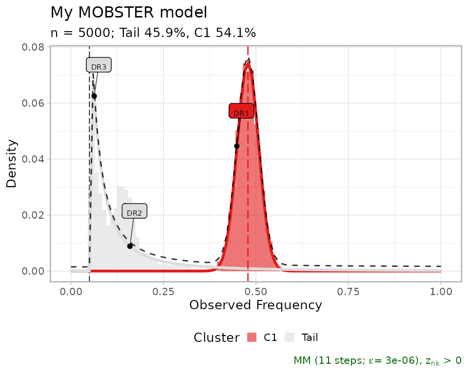

One can hide the drivers setting `is_driver` to `FALSE`.

``` r
copy_best_fit = best_fit 
copy_best_fit$data$is_driver = FALSE 

plot(copy_best_fit)
```

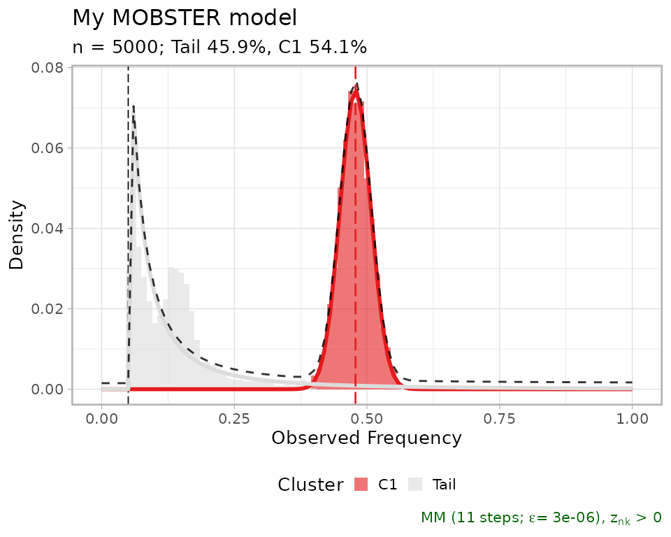

It is possible to annotate further labels to this plot, providing just a
VAF value and a `driver_label` value. Each annotation points to the VAF
value on the x-axis, and on the corresponding mixture density value for
the y-axis.

``` r
plot(best_fit,
     annotation_extras = 
       data.frame(
         VAF = .35, 
         driver_label = "Something",
         stringsAsFactors = FALSE)
     )
```

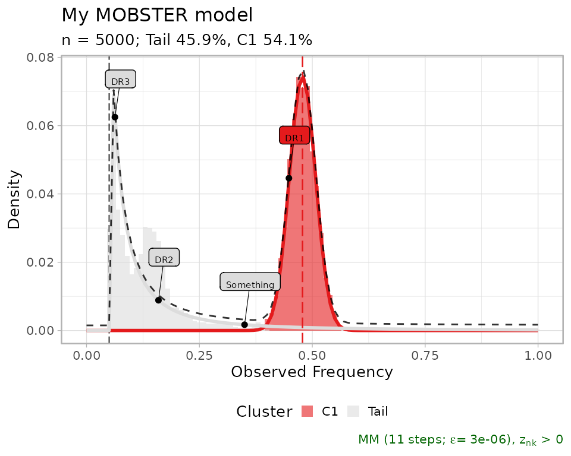

Other visualisations can be obtained as follows

``` r
ggpubr::ggarrange(
  plot(best_fit, tail_color = "darkorange"),                  # Tail color
  plot(best_fit, beta_colors = c("steelblue", "darkorange")), # Beta colors
  plot(best_fit, cutoff_assignment = .50),                    # Hide mutations based on latent variables 
  plot(best_fit, secondary_axis = "SSE"),               # Add a mirrored y-axis with the % of SSE
  ncol = 2,
  nrow = 2
)
```

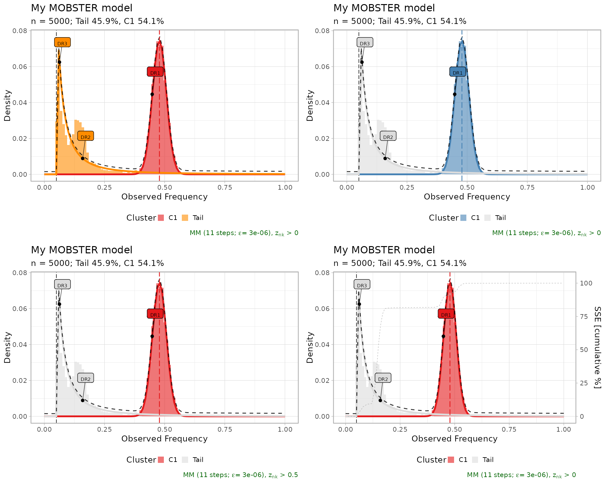

## Fit statistics

You can plot the latent variables, which are used to determine *hard
clustering* assignments of the input mutations. A `cutoff_assignment`
determines a cut to prioritize assignments above the hard clustering
assignments probability. Non-assignable mutations (`NA` values) are on
top of the heatmap.

``` r
ggpubr::ggarrange(
  mobster::plot_latent_variables(best_fit, cutoff_assignment = 0),
  mobster::plot_latent_variables(best_fit, cutoff_assignment = 0.4),
  mobster::plot_latent_variables(best_fit, cutoff_assignment = 0.8),
  mobster::plot_latent_variables(best_fit, cutoff_assignment = 0.97),
  ncol = 4,
  nrow = 1
)
```

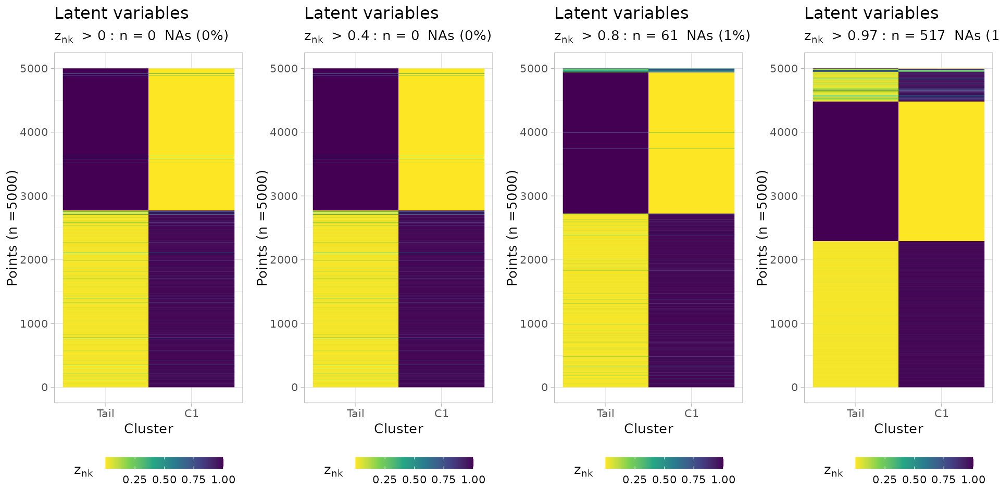

You can plot a barplot of the mixing proportions, using the same colour
scheme for the fit (here, default). The barplot annotates a dashed line
by default at 2%.

``` r
plot_mixing_proportions(best_fit)
#> Warning in geom_text(data = NULL, aes(label = "2%", x = 0.1, y = 0.04), : All aesthetics have length 1, but the data has 2 rows.
#> ℹ Please consider using `annotate()` or provide this layer with data containing
#>   a single row.
#> Warning: No shared levels found between `names(values)` of the manual scale and the
#> data's colour values.
```

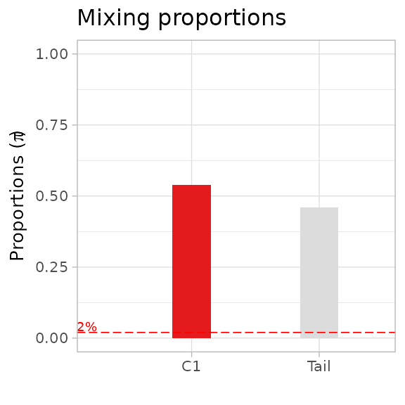

The negative log-likelihood `NLL` of the fit can be plot against the
iteration steps, so to check that the trend is decreasing over time.

``` r
plot_NLL(best_fit)
```

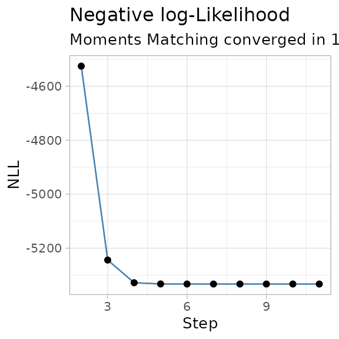

A contributor to the `NLL` is the entropy of the mixture, which can be
visualized along with the reduced entropy, which is used by `reICL`.

``` r
plot_entropy(best_fit)
```

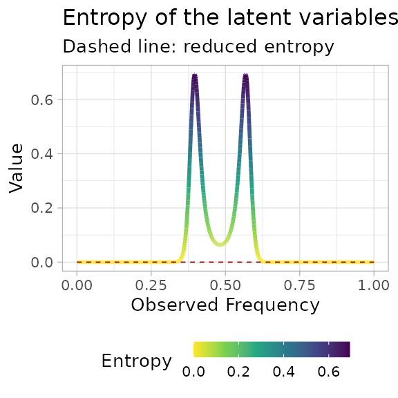

## Inspecting alternative fits

Alternative models are returned by function `mobster_fit`, and can be
easly visualized; the table reporting the scores is a good place to
start investigating alternative fits to the data.

``` r
print(fit$fits.table)
#>         NLL        BIC        AIC   entropy        ICL reduced.entropy
#> 1 -5332.989 -10614.876 -10653.979  323.0129 -10291.863          0.0000
#> 5 -5301.274 -10551.444 -10590.547  375.9632 -10175.481          0.0000
#> 2 -5332.968 -10589.282 -10647.937 2179.1747  -8410.107       1894.6576
#> 4 -4442.905  -8834.707  -8873.810  544.0527  -8290.654        544.0527
#> 3 -1570.709  -3115.867  -3135.419    0.0000  -3115.867          0.0000
#>        reICL size K  tail
#> 1 -10614.876    6 1  TRUE
#> 5 -10551.444    6 1  TRUE
#> 2  -8694.625    9 2  TRUE
#> 4  -8290.654    6 2 FALSE
#> 3  -3115.867    3 1 FALSE
```

Top three fits, plot in-line.

``` r
ggpubr::ggarrange(
  plot(fit$runs[[1]]),
  plot(fit$runs[[2]]),
  plot(fit$runs[[3]]),
  ncol = 3, 
  nrow = 1
)
```

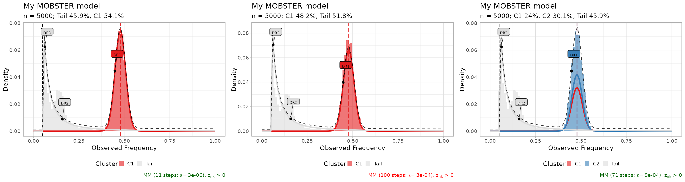

The sum of squared error (SSE) between the fit density and the data
(binned with bins of size `0.01`), can be plot to compare multiple fits.
This measure is a sort of “goodness of fit” statistics.

``` r
# Goodness of fit (SSE), for the top 3 fits.
plot_gofit(fit, TOP = 3)
```

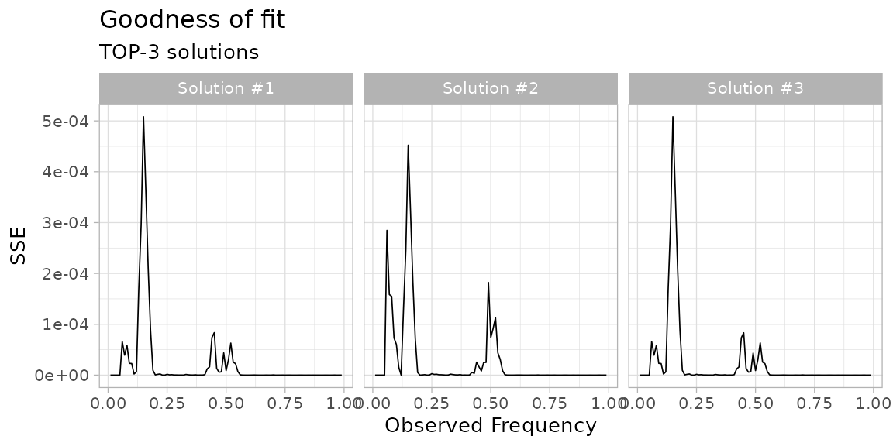

The scores for model selection can also be compared graphically.

``` r
plot_fit_scores(fit)
```

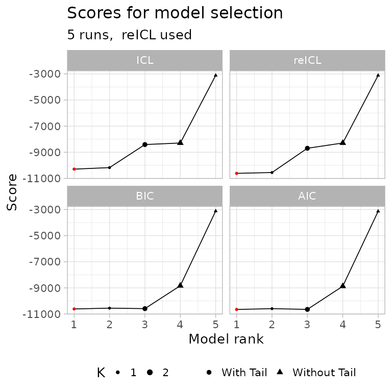

In the above plot, all the computed scoring functions (`BIC`, `AIC`,
`ICL` and `reICL`) are shown. This plot can be used to quickly grasp the
best model with, for instance, the default score (`reICL`) is also the
best for other scores. In this graphics the red dot represents the best
model according to each possible score.

## Model-selection report

A general model-selection report assembles most of the above graphics.

``` r
plot_model_selection(fit, TOP = 5)
```

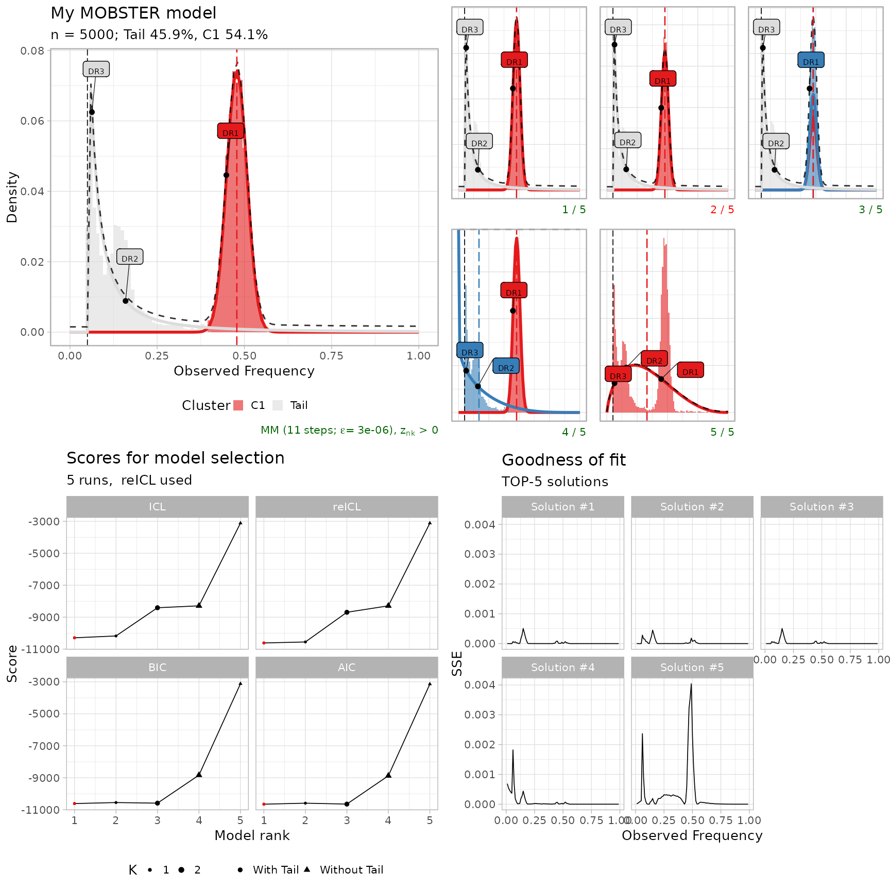

## Fit animation

It seems useless, but if you want you can animate `mobster` fits using
[plotly](https://plotly.com/r/).

``` r
example_data$is_driver = FALSE

# Get a custom model using trace = TRUE
animation_model = mobster_fit(
  example_data, 
  parallel =  FALSE, 
  samples = 3,
  init = 'random',
  trace = TRUE,
  K = 2,
  tail = TRUE)$best
#>  [ MOBSTER fit ] 
#> 

# Prepare trace, and retain every 5% of the fitting steps
trace = split(animation_model$trace, f = animation_model$trace$step)
steps = seq(1, length(trace), round(0.05 * length(trace)))
  
# Compute a density per step, using the template_density internal function
trace_points = lapply(steps, function(w, x) {
  new.x = x
  new.x$Clusters = trace[[w]]
  
  # Hidden function (:::)
  points = mobster:::template_density(
    new.x,
    x.axis = seq(0, 1, 0.01),
    binwidth = 0.01,
    reduce = TRUE
  )
  points$step = w
  
  points
},
x = animation_model)
  
trace_points = Reduce(rbind, trace_points)
  
# Use plotly to create a ShinyApp
require(plotly)
    
trace_points %>%
  plot_ly(
    x = ~ x,
    y = ~ y,
    frame = ~ step,
    color = ~ cluster,
    type = 'scatter',
    mode = 'markers',
    showlegend = TRUE
  )
```
