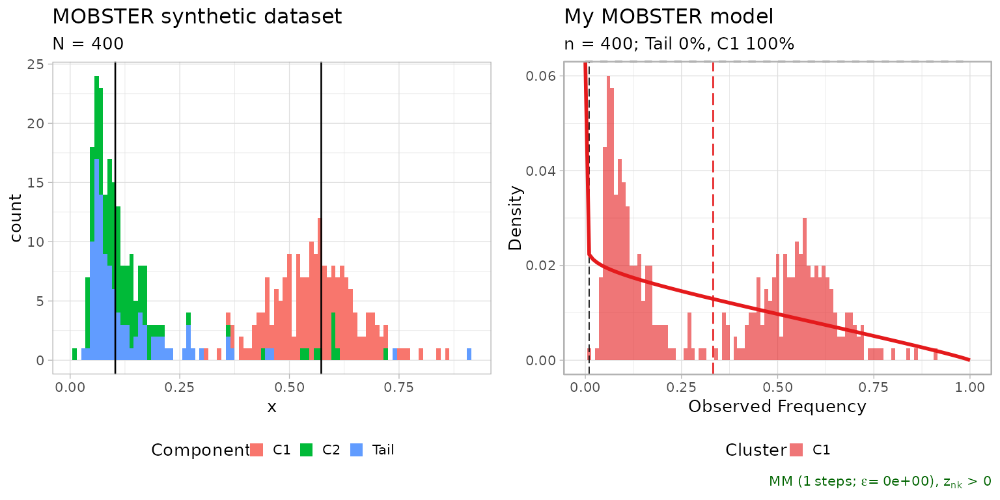
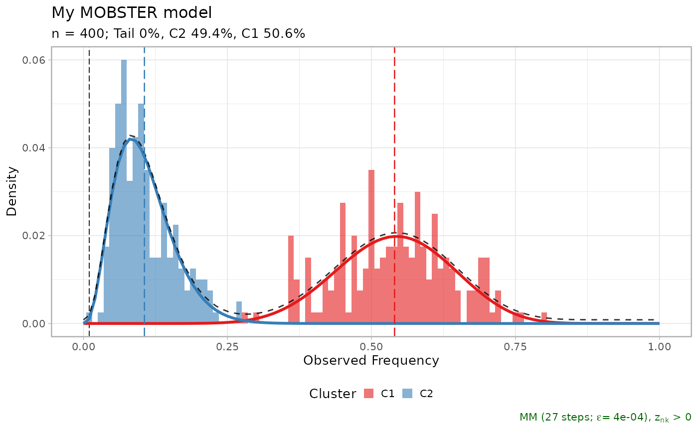
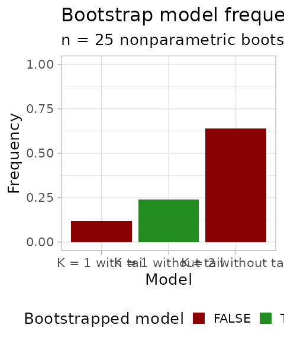
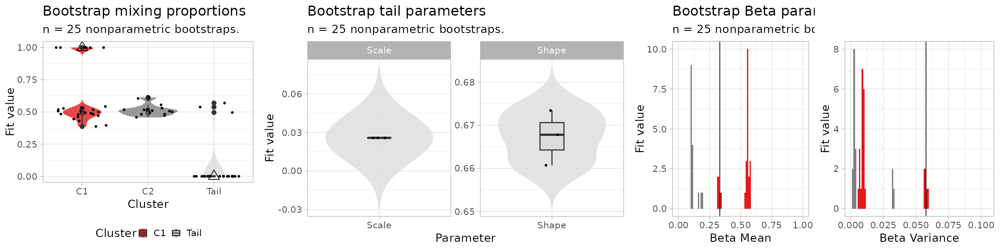
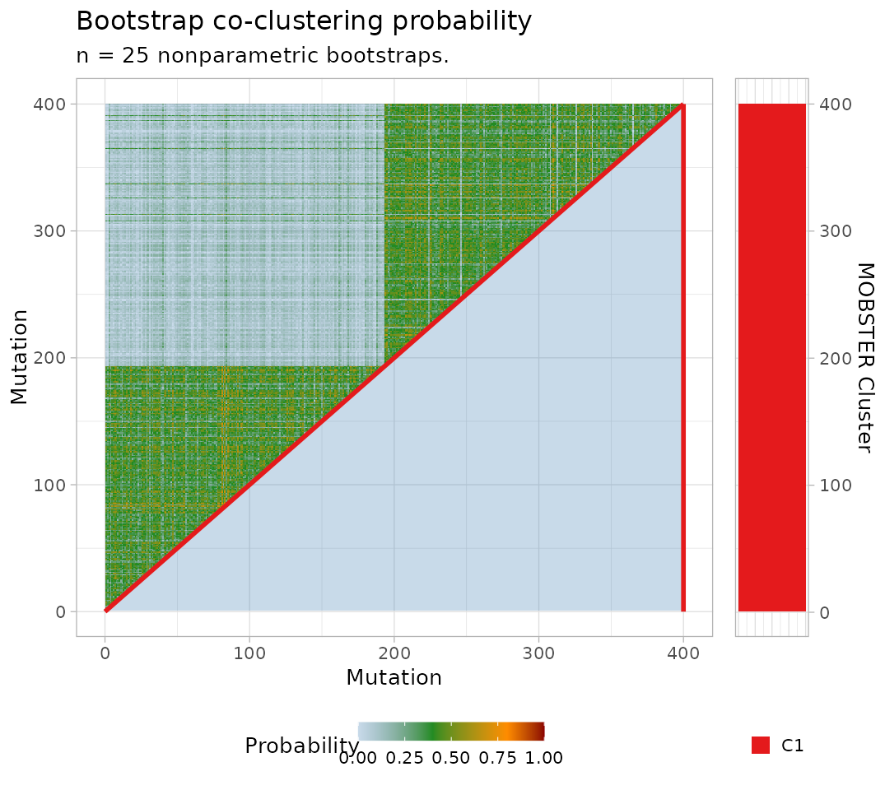

# 3. Confidence estimation by the bootstrap

``` r
library(mobster)
library(tidyr)
library(dplyr)
```

## Bootstrapping a model

This vignette describes how to compute the *bootstrap* confidence of a
MOBSTER model.

Both *parametric* and *nonparametric* bootstrap options are available:
the former samples data from the model, the latter re-samples the data
(with repetitions). Statistics are bootstrap estimates (averages) of the
bootstrap fits. In both cases a model bootstrap probability can be
computed, as well as the probability of clustering together any two
mutations.

We show this with a small synthetic dataset .to speed up the
computation.

``` r
# Data generation
dataset = random_dataset(
  N = 400, 
  seed = 123, 
  Beta_variance_scaling = 100
  )

# Fit model -- FAST option to speed up the vignette
fit = mobster_fit(dataset$data, auto_setup = 'FAST')
#>  [ MOBSTER fit ] 
#> 

# Composition with cowplot
cowplot::plot_grid(
  dataset$plot, 
  plot(fit$best), 
  ncol = 2, 
  align = 'h') %>%
  print
```



Now we can compute `n.resamples` nonparametric bootstraps using function
`mobster_bootstrap`, passing parameters to the calls of `mobster_fit`.
This function by defaults runs the fits in parallel (using a default
percentage of the available cores); parallel computing capabilities are
achieved using package
[easypar](https://github.com/caravagnalab/easypar).

``` r
# The returned object contains also the list of bootstrap resamples, and the fits.
bootstrap_results = mobster_bootstrap(
  fit$best,
  bootstrap = 'nonparametric',
  cores.ratio = 0, # can be increased
  n.resamples = 25,
  auto_setup = 'FAST' # forwarded to mobster_fit
  )
#>  [ MOBSTER bootstrap ~ 25 resamples from nonparametric bootstrap ] 
#> 
```

The output object includes the bootstrap resamples, the fits and
possible error returned by the runs.

``` r
# Resamples are available for inspection as list of lists, 
# with a mapping to record the mutation id of the resample data.
# Ids are row numbers.
print(bootstrap_results$resamples[[1]][[1]] %>% as_tibble())
#> # A tibble: 400 × 3
#>       id    VAF original.id
#>    <int>  <dbl>       <int>
#>  1     1 0.553           12
#>  2     2 0.0999         259
#>  3     3 0.189          393
#>  4     4 0.525           14
#>  5     5 0.422          141
#>  6     6 0.570          192
#>  7     7 0.539          148
#>  8     8 0.687          106
#>  9     9 0.0669         375
#> 10    10 0.489           16
#> # ℹ 390 more rows

# Fits are available inside the $fits list
print(bootstrap_results$fits[[1]])
#> ── [ MOBSTER ] My MOBSTER model n = 400 with k = 2 Beta(s) without tail ────────
#> ● Clusters: π = 51% [C1] and 49% [C2], with π > 0.
#> ✖ No tail fit.
#> 
#> ● Beta C1 [n = 202, 51%] with mean = 0.54.
#> ● Beta C2 [n = 198, 49%] with mean = 0.11.
#> ℹ Score(s): NLL = -237.82; ICL = -435.87 (-435.87), H = 3.81 (3.81). Fit
#> converged by MM in 27 steps.
plot(bootstrap_results$fits[[1]])
```



Errors of each run are available, if any.

``` r
print(bootstrap_results$errors)
#> NULL
```

## Bootstrap statistics

Bootstrap statistics can be computed with `bootstrapped_statistics`.

With nonparametric bootstrap the data co-clustering probability is also
computed (the probability of any pair of mutations in the data to be
clustered together). Note that this probability depends on the joint
resample probability of each pair of mutations (each bootstrapped with
probability $1/n$, for $n$ mutations).

`bootstrap_statistics` shows to screen several statistics.

``` r
bootstrap_statistics = bootstrapped_statistics(
  fit$best, 
  bootstrap_results = bootstrap_results
  )
#> 
#> ── Computing model frequency ───────────────────────────────────────────────────
#> # A tibble: 3 × 3
#>   Model              Frequency fit.model
#>   <fct>                  <dbl> <lgl>    
#> 1 K = 2 without tail      0.64 FALSE    
#> 2 K = 1 without tail      0.24 TRUE     
#> 3 K = 1 with tail         0.12 FALSE
#> 
#> ── Computing confidence Intervals (CI) for empirical quantiles ─────────────────
#> 
#> Mixing proportions 
#>  # A tibble: 3 × 8
#>   cluster statistics          min lower_quantile higher_quantile   max fit.value
#>   <chr>   <chr>             <dbl>          <dbl>           <dbl> <dbl>     <dbl>
#> 1 C1      Mixing proportion 0.387          0.392           1     1             1
#> 2 C2      Mixing proportion 0.458          0.463           0.610 0.613        NA
#> 3 Tail    Mixing proportion 0              0               0.551 0.569         0
#> # ℹ 1 more variable: init.value <dbl>
#> 
#> Tail shape/ scale 
#>  # A tibble: 2 × 8
#>   cluster statistics    min lower_quantile higher_quantile    max fit.value
#>   <chr>   <chr>       <dbl>          <dbl>           <dbl>  <dbl>     <dbl>
#> 1 Tail    Scale      0.0257         0.0257          0.0257 0.0257        NA
#> 2 Tail    Shape      0.661          0.661           0.673  0.673         NA
#> # ℹ 1 more variable: init.value <dbl>
#> 
#> Beta peaks 
#>  # A tibble: 4 × 8
#>   cluster statistics     min lower_quantile higher_quantile    max fit.value
#>   <chr>   <chr>        <dbl>          <dbl>           <dbl>  <dbl>     <dbl>
#> 1 C1      Mean       0.314          0.316            0.576  0.576     0.332 
#> 2 C1      Variance   0.00545        0.00608          0.0592 0.0599    0.0577
#> 3 C2      Mean       0.0983         0.0983           0.186  0.191    NA     
#> 4 C2      Variance   0.00197        0.00198          0.0326 0.0328   NA     
#> # ℹ 1 more variable: init.value <dbl>
#> 
#> ── Computing co-clustering probability for nonparametric bootstrap ─────────────
#> Warning: `progress_estimated()` was deprecated in dplyr 1.0.0.
#> ℹ The deprecated feature was likely used in the mobster package.
#>   Please report the issue at <https://github.com/caravagnalab/mobster/issues>.
#> This warning is displayed once every 8 hours.
#> Call `lifecycle::last_lifecycle_warnings()` to see where this warning was
#> generated.
```

## Visualising bootstrap results

Object `bootstrap_statistics` contains tibbles that can be plot with
specific `mobster` functions.

``` r
# All bootstrapped values
print(bootstrap_statistics$bootstrap_values)
#> # A tibble: 242 × 5
#>    cluster statistics        fit.value init.value resample
#>    <chr>   <chr>                 <dbl>      <dbl>    <int>
#>  1 C1      a                  13.2        9.76           1
#>  2 C1      b                  11.2        9.76           1
#>  3 C1      Mean                0.540      0.402          1
#>  4 C1      Variance            0.00977    0.00952        1
#>  5 C2      a                   3.90       5.55           1
#>  6 C2      b                  32.9        5.55           1
#>  7 C2      Mean                0.106      0.179          1
#>  8 C2      Variance            0.00250    0.00459        1
#>  9 C1      Mixing proportion   0.506      0.333          1
#> 10 C2      Mixing proportion   0.494      0.333          1
#> # ℹ 232 more rows

# The model probability
print(bootstrap_statistics$bootstrap_model)
#> # A tibble: 3 × 3
#>   Model              Frequency fit.model
#>   <fct>                  <dbl> <lgl>    
#> 1 K = 2 without tail      0.64 FALSE    
#> 2 K = 1 without tail      0.24 TRUE     
#> 3 K = 1 with tail         0.12 FALSE

# The parameter stastics
print(bootstrap_statistics$bootstrap_statistics)
#> # A tibble: 15 × 8
#>    cluster statistics              min lower_quantile higher_quantile      max
#>    <chr>   <chr>                 <dbl>          <dbl>           <dbl>    <dbl>
#>  1 C1      Mean                0.314          0.316            0.576    0.576 
#>  2 C1      Mixing proportion   0.387          0.392            1        1     
#>  3 C1      Variance            0.00545        0.00608          0.0592   0.0599
#>  4 C1      a                   0.869          0.878           22.6     25.0   
#>  5 C1      b                   1.81           1.83            17.3     19.1   
#>  6 C2      Mean                0.0983         0.0983           0.186    0.191 
#>  7 C2      Mixing proportion   0.458          0.463            0.610    0.613 
#>  8 C2      Variance            0.00197        0.00198          0.0326   0.0328
#>  9 C2      a                   0.544          0.578            4.32     4.32  
#> 10 C2      b                   2.74           2.81            39.5     39.6   
#> 11 Tail    Mean              Inf            Inf              Inf      Inf     
#> 12 Tail    Mixing proportion   0              0                0.551    0.569 
#> 13 Tail    Scale               0.0257         0.0257           0.0257   0.0257
#> 14 Tail    Shape               0.661          0.661            0.673    0.673 
#> 15 Tail    Variance          Inf            Inf              Inf      Inf     
#> # ℹ 2 more variables: fit.value <dbl>, init.value <dbl>
```

Bootstrapping, one can plot the model frequency across re-samples. A
model is identified by its mixture components (e.g., 2 Betas plus one
tail).

``` r
plot_bootstrap_model_frequency(
  bootstrap_results, 
  bootstrap_statistics
  )
```



The bootstrap estimates of the parameters can be visualised.

``` r
# Plot the mixing proportions
mplot = plot_bootstrap_mixing_proportions(
  fit$best, 
  bootstrap_results = bootstrap_results, 
  bootstrap_statistics = bootstrap_statistics
  )

# Plot the tail parameters
tplot = plot_bootstrap_tail(
  fit$best, 
  bootstrap_results = bootstrap_results, 
  bootstrap_statistics = bootstrap_statistics
  )

# Plot the Beta parameters
bplot = plot_bootstrap_Beta(
  fit$best, 
  bootstrap_results = bootstrap_results, 
  bootstrap_statistics = bootstrap_statistics
  )
#> Warning: No shared levels found between `names(values)` of the manual scale and the
#> data's colour values.
#> Warning: Removed 4 rows containing missing values or values outside the scale range
#> (`geom_bar()`).
#> Warning: No shared levels found between `names(values)` of the manual scale and the
#> data's colour values.
#> Warning: Removed 4 rows containing missing values or values outside the scale range
#> (`geom_bar()`).

# Figure
figure = ggpubr::ggarrange(
  mplot,
  tplot,
  bplot,
  ncol = 3, nrow = 1,
  widths = c(.7, 1, 1)
)
#> Warning: No shared levels found between `names(values)` of the manual scale and the
#> data's colour values.
#> Warning: No shared levels found between `names(values)` of the manual scale and the
#> data's colour values.

print(figure)
```



For a nonparametric bootstrap we can plot also the co-clustering
probability of the data.

``` r

plot_bootstrap_coclustering(
  fit$best, 
  bootstrap_results = bootstrap_results, 
  bootstrap_statistics = bootstrap_statistics
  )
#> Warning: No shared levels found between `names(values)` of the manual scale and the
#> data's colour values.
```


