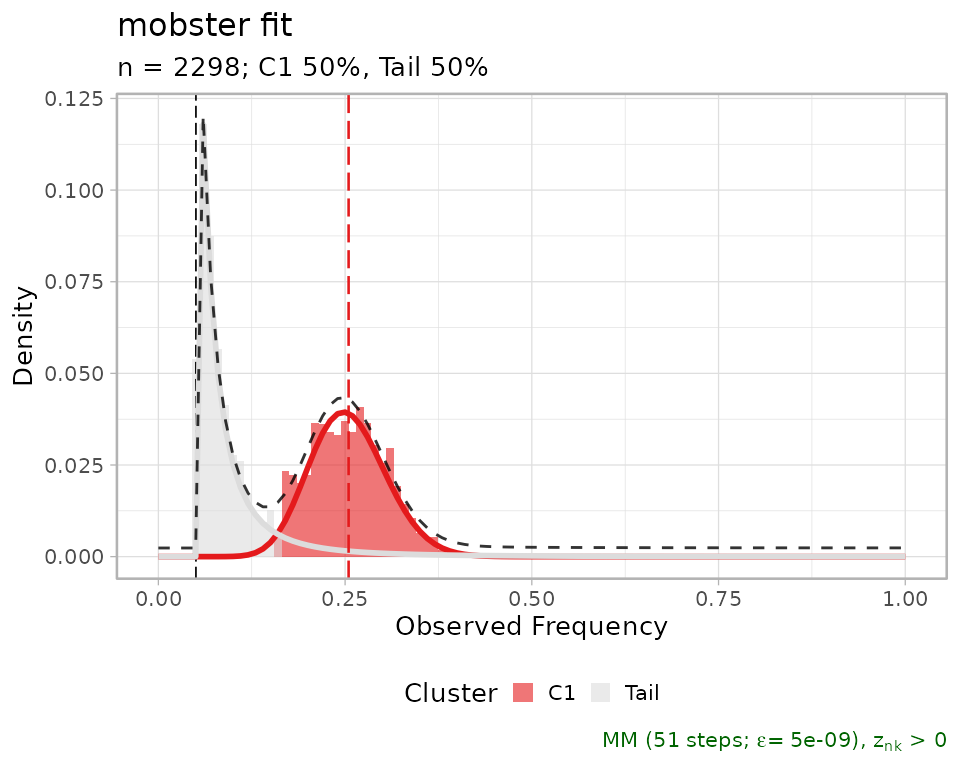
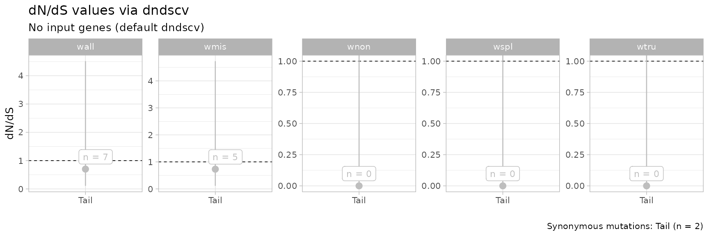
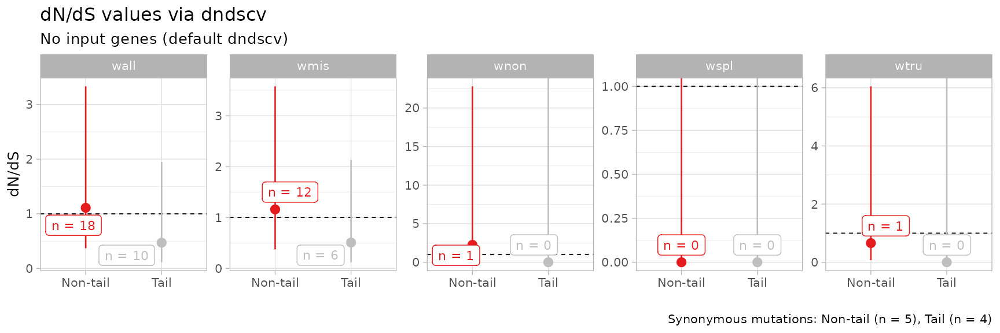

# 5. dN/dS statistics

``` r
library(mobster)
library(tidyr)
library(dplyr)
```

## Computing dnds values

`mobster` interfaces with the
[dndscv](https://github.com/im3sanger/dndscv/) R package to compute
dN/dS values from its output clusters. The method implemented in
`dndscv` is described in *Martincorena, et al.* *“Universal patterns of
selection in cancer and somatic tissues”*, Cell 171.5 (2017): 1029-1041;
[PMID 29056346](https://www.ncbi.nlm.nih.gov/pubmed/29056346)).

**Requirements.** In order to be able to compute dN/dS values mutations
data must store their *genomic coordinates*:

- chromosome location `chrom`,
- position `from`,
- reference alleles `alt` and `ref`.

Besides, it is important to know what is the reference genome used to
align the genome; this information will be used by `dndscv` to annotate
input mutations.

We show this analysis with the fits for one of the lung samples
available in the package.

``` r
fit = mobster::LUFF76_lung_sample

# Print and plot the model
print(fit$best)
#> ── [ MOBSTER ]  n = 2298 with k = 1 Beta(s) and a tail ─────────────────────────
#> ● Clusters: π = 50% [Tail] and 50% [C1], with π > 0.
#> ● Tail [n = 1076, 50%] with alpha = 2.
#> ● Beta C1 [n = 1222, 50%] with mean = 0.25.
#> ℹ Score(s): NLL = -3095.24; ICL = -5784.22 (-6144.04), H = 359.82 (0). Fit
#> converged by MM in 51 steps.
plot(fit$best)
#> Warning: Using `size` aesthetic for lines was deprecated in ggplot2 3.4.0.
#> ℹ Please use `linewidth` instead.
#> ℹ The deprecated feature was likely used in the mobster package.
#>   Please report the issue at <https://github.com/caravagnalab/mobster/issues>.
#> This warning is displayed once every 8 hours.
#> Call `lifecycle::last_lifecycle_warnings()` to see where this warning was
#> generated.
#> Warning: The `<scale>` argument of `guides()` cannot be `FALSE`. Use "none" instead as
#> of ggplot2 3.3.4.
#> ℹ The deprecated feature was likely used in the mobster package.
#>   Please report the issue at <https://github.com/caravagnalab/mobster/issues>.
#> This warning is displayed once every 8 hours.
#> Call `lifecycle::last_lifecycle_warnings()` to see where this warning was
#> generated.
#> Warning: The dot-dot notation (`..count..`) was deprecated in ggplot2 3.4.0.
#> ℹ Please use `after_stat(count)` instead.
#> ℹ The deprecated feature was likely used in the mobster package.
#>   Please report the issue at <https://github.com/caravagnalab/mobster/issues>.
#> This warning is displayed once every 8 hours.
#> Call `lifecycle::last_lifecycle_warnings()` to see where this warning was
#> generated.
```



We compute the values using the clustering assignments from the best
fit.

``` r
clusters = Clusters(fit$best)
print(clusters)
#> # A tibble: 2,298 × 14
#>      Key Callers     t_alt_count t_ref_count Variant_Classification    DP    VAF
#>    <int> <chr>             <int>       <int> <chr>                  <int>  <dbl>
#>  1   330 mutect,str…          23         149 intergenic               172 0.134 
#>  2   331 mutect,str…          53         133 intergenic               186 0.285 
#>  3   332 mutect,str…           8         132 intergenic               140 0.0571
#>  4   334 mutect,str…          26         112 intergenic               138 0.188 
#>  5   335 mutect,str…          40         102 intronic                 142 0.282 
#>  6   336 mutect,str…          32          95 intronic                 127 0.252 
#>  7   337 mutect,str…          28         134 intergenic               162 0.173 
#>  8   338 mutect,str…          14         148 intergenic               162 0.0864
#>  9   339 mutect,str…          11         108 intronic                 119 0.0924
#> 10   340 mutect,str…          11         171 intergenic               182 0.0604
#> # ℹ 2,288 more rows
#> # ℹ 7 more variables: chr <chr>, from <chr>, ref <chr>, alt <chr>,
#> #   cluster <chr>, Tail <dbl>, C1 <dbl>
```

The available clusters are `C1` and `Tail`; `C1` is the clonal cluster.
We compute dN/dS with the default parameters.

``` r
# Run by cluster and default gene list
dnds_stats = dnds(
  clusters,
  gene_list = NULL
)
#> Missing 'sample' column, assuming mutations from a single patient (adding a sample label otherwise).
#> ℹ 2298 mutations; 'by cluster' groups in 0 samples, with no genes (default dndscv).
#> [refdb = hg19] Removing chr from chromosome names for hg19 reference compatability
#> 
#>   C1 Tail 
#> 1222 1076
#> 
#> ── Running dndscv ──────────────────────────────────────────────────────────────
#> 
#> ── Group Tail
#> [1] Loading the environment...
#> [2] Annotating the mutations...
#> Loading required namespace: GenomeInfoDb
#> [3] Estimating global rates...
#> [4] Running dNdSloc...
#> [5] Running dNdScv...
#>     Regression model for substitutions (theta = 6.69e-05).
#> 
#> ── Group C1
#> [1] Loading the environment...
#> [2] Annotating the mutations...
#> [3] Estimating global rates...
#> [4] Running dNdSloc...
#> [5] Running dNdScv...
#> dndscv error
#> Error in while ((it <- it + 1) < limit && abs(del) > eps) {: missing value where TRUE/FALSE needed
#> 
#> ── dndscv results ────────────────────────────── wall, wmis, wnon, wspl, wtru ──
#> # A tibble: 5 × 5
#>   name            mle cilow cihigh dnds_group
#>   <chr>         <dbl> <dbl>  <dbl> <chr>     
#> 1 wmis  0.731         0.113   4.73 Tail      
#> 2 wnon  0.00000000804 0     Inf    Tail      
#> 3 wspl  0.0000000260  0     Inf    Tail      
#> 4 wtru  0.0000000170  0     Inf    Tail      
#> 5 wall  0.701         0.109   4.51 Tail
```

The statistics can be computed for a custom grouping of the clusters.
Here it does not make much difference because we have only the clonal
cluster, and the tail; but if we had one subclone `C2` we could have
pooled together the mutations in the clones using

``` r
# Not run here
dnds_stats = dnds(
  clusters,
  mapping = c(`C1` = 'Non-tail', `C2` = 'Non-tail', `Tail` = 'Tail'),
  gene_list = NULL
)
```

In the above analysis we have run `dndscv` using the default gene list
(`gene_list = NULL`). Notice that errors raised by `dndscv` are
intercepted by `mobster`; some of this errors might originate from a
dataset with not enough substitutions to compute dN/dS.

The call returns:

- the table computed by `dndscv`, where column `dnds_group` labels the
  group.
- a `ggplot` plot of the point estimates and the confidence interval;

``` r
# Summary statistics
print(dnds_stats$dnds_summary)
#> # A tibble: 5 × 5
#>   name            mle cilow cihigh dnds_group
#>   <chr>         <dbl> <dbl>  <dbl> <chr>     
#> 1 wmis  0.731         0.113   4.73 Tail      
#> 2 wnon  0.00000000804 0     Inf    Tail      
#> 3 wspl  0.0000000260  0     Inf    Tail      
#> 4 wtru  0.0000000170  0     Inf    Tail      
#> 5 wall  0.701         0.109   4.51 Tail

# Table observation countns
print(dnds_stats$dndscv_table)
#> # A tibble: 20,091 × 15
#>    gene_name n_syn n_mis n_non n_spl wmis_cv wnon_cv wspl_cv   pmis_cv ptrunc_cv
#>    <chr>     <dbl> <dbl> <dbl> <dbl>   <dbl>   <dbl>   <dbl>     <dbl>     <dbl>
#>  1 ATF4          0     1     0     0   5262.       0       0 0.0001000     0.998
#>  2 C14orf79      0     1     0     0   4702.       0       0 0.000113      0.998
#>  3 FAM189A1      0     1     0     0   3155.       0       0 0.000172      0.997
#>  4 RNF150        0     1     0     0   2793.       0       0 0.000196      0.998
#>  5 NEO1          0     1     0     0   1141.       0       0 0.000509      0.994
#>  6 TTN           0     0     0     0      0        0       0 0.836         0.968
#>  7 MUC16         0     0     0     0      0        0       0 0.895         0.990
#>  8 OBSCN         0     0     0     0      0        0       0 0.915         0.989
#>  9 SYNE1         0     0     0     0      0        0       0 0.917         0.985
#> 10 NEB           0     0     0     0      0        0       0 0.919         0.978
#> # ℹ 20,081 more rows
#> # ℹ 5 more variables: pallsubs_cv <dbl>, qmis_cv <dbl>, qtrunc_cv <dbl>,
#> #   qallsubs_cv <dbl>, dnds_group <chr>

# Plot
print(dnds_stats$plot)
```



The default plot contains results obtained from all substitution models
available in `dndscv`. Specific models can be required using the
parameters of the `dnds` function.

## Using custom genes lists

A custom list of genes can be supplied in the call to `dnds` as the
variable `genes_list`; the package provides 4 lists of interests for
this type of computation:

- a list of driver genes compiled in
  `Martincorena et al. Cell 171.5 (2017): 1029-1041.`;
- a list of driver genes compiled in
  `Tarabichi, et al. Nature Genetics 50.12 (2018): 1630.`;
- a list of essential genes compiled in
  `Wang et al. Science 350.6264 (2015): 1096-1101.`;
- a list of essential genes compiled in
  `Bloomen et al. Science 350.6264 (2015): 1092-1096.`.

which are available to load.

``` r
# Load the list
data('cancer_genes_dnds', package = 'mobster')

# Each sublist is a list 
print(lapply(cancer_genes_dnds, head))
#> $Martincorena_drivers
#> [1] "CCDC6"     "EIF1AX"    "HIST1H2BD" "MED12"     "POLE"      "SMARCB1"  
#> 
#> $Tarabichi_drivers
#> [1] "ACVR1"  "ACVR1B" "AKT1"   "ALK"    "AMER1"  "APC"   
#> 
#> $Wang_essentials
#> [1] "ABL1"    "RPL23A"  "AARS2"   "TRMT112" "FARSA"   "ABCB7"  
#> 
#> $Bloomen_essentials
#> [1] "AARS"     "AASDHPPT" "AATF"     "ABCB7"    "ABCE1"    "ABCF1"
```

A custom gene list can be used as follows.

``` r
# Not run here
dnds_stats = dnds(
  clusters,
  mapping = c(`C1` = 'Non-tail', `C2` = 'Non-tail', `C3` = 'Non-tail', `Tail` = 'Tail'),
  gene_list = cancer_genes_dnds$Martincorena_drivers
)
```

## Pooling data from multiple patients

The input format of the `dnds` function allows to pool data from several
fits at once. We pool data from the 2 datasets available in the package.

``` r
# 2 lung samples
data('LU4_lung_sample', package = 'mobster')
data('LUFF76_lung_sample', package = 'mobster')
```

We pool the data selecting the required columns.

``` r
dnds_multi = dnds(
  rbind(
    Clusters(LU4_lung_sample$best) %>% select(chr, from, ref, alt, cluster) %>% mutate(sample = 'LU4'),
    Clusters(LUFF76_lung_sample$best) %>% select(chr, from, ref, alt, cluster) %>% mutate(sample = 'LUFF76')
  ),
  mapping = c(`C1` = 'Non-tail',  # Pool together all clonal mutations
              `Tail` = 'Tail'     # Pool together all tail mutations),
  )
)
#> ℹ 3580 mutations; 2 groups in 2 samples, with no genes (default dndscv).
#> [refdb = hg19] Removing chr from chromosome names for hg19 reference compatability
#> 
#> Non-tail     Tail 
#>     2194     1386
#> 
#> ── Running dndscv ──────────────────────────────────────────────────────────────
#> 
#> ── Group Non-tail
#> [1] Loading the environment...
#> [2] Annotating the mutations...
#> [3] Estimating global rates...
#> [4] Running dNdSloc...
#> [5] Running dNdScv...
#>     Regression model for substitutions (theta = 17.5).
#> 
#> ── Group Tail
#> [1] Loading the environment...
#> [2] Annotating the mutations...
#> [3] Estimating global rates...
#> [4] Running dNdSloc...
#> [5] Running dNdScv...
#>     Regression model for substitutions (theta = 8.54).
#> ── dndscv results ────────────────────────────── wall, wmis, wnon, wspl, wtru ──
#> # A tibble: 10 × 5
#>    name            mle  cilow cihigh dnds_group
#>    <chr>         <dbl>  <dbl>  <dbl> <chr>     
#>  1 wmis  1.16          0.375    3.58 Non-tail  
#>  2 wnon  2.25          0.223   22.8  Non-tail  
#>  3 wspl  0.0000000301  0      Inf    Non-tail  
#>  4 wtru  0.658         0.0716   6.05 Non-tail  
#>  5 wall  1.11          0.370    3.33 Non-tail  
#>  6 wmis  0.508         0.121    2.13 Tail      
#>  7 wnon  0.00000000835 0      Inf    Tail      
#>  8 wspl  0.0000000461  0      Inf    Tail      
#>  9 wtru  0.0000000201  0      Inf    Tail      
#> 10 wall  0.472         0.115    1.95 Tail

print(dnds_multi$plot)
```


