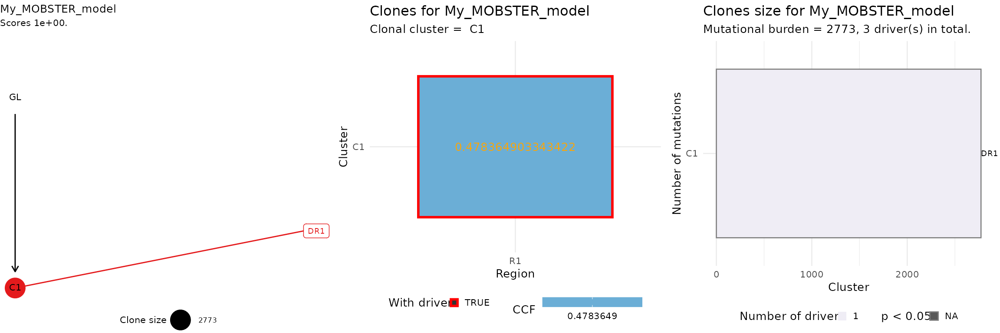

# 6. Clone trees from clusters

``` r
library(mobster)
library(tidyr)
library(dplyr)
```

Clone trees from `mobster` fits can be computing using the internal
interface with [ctree](https://caravagnalab.github.io/ctree).

You need to have drivers annotated your object if you want to use
`ctree`, and every `driver_label` has to be unique, as it will be used
as the `variantID` column to identify the driver event.

We show the analysis with a synthetic dataset.

``` r
# Example data where we annotate 3 events as drivers
example_data = Clusters(mobster::fit_example$best)
example_data = example_data %>% dplyr::select(-cluster, -Tail, -C1, -C2)
  
# Drivers annotation
drivers_rows = c(2239, 3246, 3800)

example_data$is_driver = FALSE
example_data$driver_label = NA

example_data$is_driver[drivers_rows] = TRUE
example_data$driver_label[drivers_rows] = c("DR1", "DR2", "DR3")

# Fit and print the data
fit = mobster_fit(example_data, auto_setup = 'FAST')
#>  [ MOBSTER fit ] 
#> 
#> ✔ Loaded input data, n = 5000.
#> ❯ n = 5000. Mixture with k = 1,2 Beta(s). Pareto tail: TRUE and FALSE. Output
#> clusters with π > 0.02 and n > 10.
#> ! mobster automatic setup FAST for the analysis.
#> ❯ Scoring (without parallel) 2 x 2 x 2 = 8 models by reICL.
#> ℹ MOBSTER fits completed in 8.6s.
#> ── [ MOBSTER ] My MOBSTER model n = 5000 with k = 1 Beta(s) and a tail ─────────
#> ● Clusters: π = 54% [C1] and 46% [Tail], with π > 0.
#> ● Tail [n = 2227, 46%] with alpha = 1.1.
#> ● Beta C1 [n = 2773, 54%] with mean = 0.48.
#> ℹ Score(s): NLL = -5332.99; ICL = -10291.86 (-10614.88), H = 323.01 (0). Fit
#> converged by MM in 11 steps.
#> ℹ The fit object model contains also drivers annotated.
#> # A tibble: 3 × 4
#>      VAF is_driver driver_label cluster
#>    <dbl> <lgl>     <chr>        <chr>  
#> 1 0.448  TRUE      DR1          C1     
#> 2 0.159  TRUE      DR2          Tail   
#> 3 0.0629 TRUE      DR3          Tail

best_fit = fit$best
print(best_fit)
#> ── [ MOBSTER ] My MOBSTER model n = 5000 with k = 1 Beta(s) and a tail ─────────
#> ● Clusters: π = 54% [C1] and 46% [Tail], with π > 0.
#> ● Tail [n = 2227, 46%] with alpha = 1.1.
#> ● Beta C1 [n = 2773, 54%] with mean = 0.48.
#> ℹ Score(s): NLL = -5332.99; ICL = -10291.86 (-10614.88), H = 323.01 (0). Fit
#> converged by MM in 11 steps.
#> ℹ The fit object model contains also drivers annotated.
#> # A tibble: 3 × 4
#>      VAF is_driver driver_label cluster
#>    <dbl> <lgl>     <chr>        <chr>  
#> 1 0.448  TRUE      DR1          C1     
#> 2 0.159  TRUE      DR2          Tail   
#> 3 0.0629 TRUE      DR3          Tail
```

## Tree computation

Tree computation removes any mutation that is assigned to a `Tail`
cluster because the clone tree represents the clones.

``` r
# Get the trees, select top-rank
trees = get_clone_trees(best_fit)
#>  [ ctree ~ clone trees generator for My_MOBSTER_model ] 
#> 
#> # A tibble: 1 × 5
#>   cluster    R1 nMuts is.clonal is.driver
#>   <chr>   <dbl> <dbl> <lgl>     <lgl>    
#> 1 C1      0.478  2773 TRUE      TRUE
#> ! Model with 1 node, trivial trees returned
#> ✔ 1  trees with non-zero score, storing 1
#> 
#> This tree has 1 node, creating a monoclonal model disregarding the input matrix.
```

The *top-rank* tree is in position `1` of `trees`; `ctree` implements S3
object methods to print an plot a tree.

``` r
top_rank = trees[[1]]

# Print with S3 methods from ctree
ctree:::print.ctree(top_rank)
#>  [ ctree - ctree rank 1/1 for My_MOBSTER_model ] 
#> 
#> # A tibble: 1 × 5
#>   cluster    R1 nMuts is.clonal is.driver
#>   <chr>   <dbl> <dbl> <lgl>     <lgl>    
#> 1 C1      0.478  2773 TRUE      TRUE     
#> 
#> Tree shape (drivers annotated)  
#> 
#>   \-GL
#>    \-C1 [R1] :: DR1
#> 
#> Information transfer  
#> 
#>    GL ---> DR1 
#> 
#> Tree score 1 
#> 
```

We can plot the top tree, aggregating different `ctree` plots.

``` r
# 1) Clone tree
# 2) Input ctree data (here adjusted VAF)
# 3) Clone size barplot
ggpubr::ggarrange(
  ctree::plot.ctree(top_rank),
  ctree::plot_CCF_clusters(top_rank),
  ctree::plot_clone_size(top_rank),
  nrow = 1,
  ncol = 3
)
```


