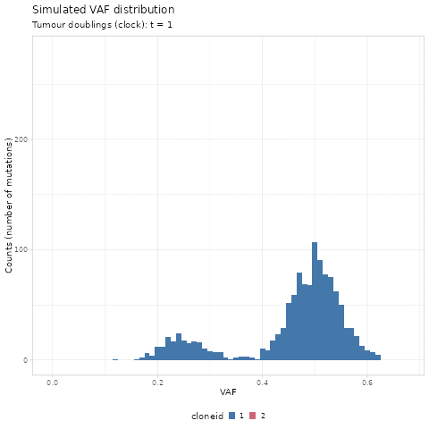
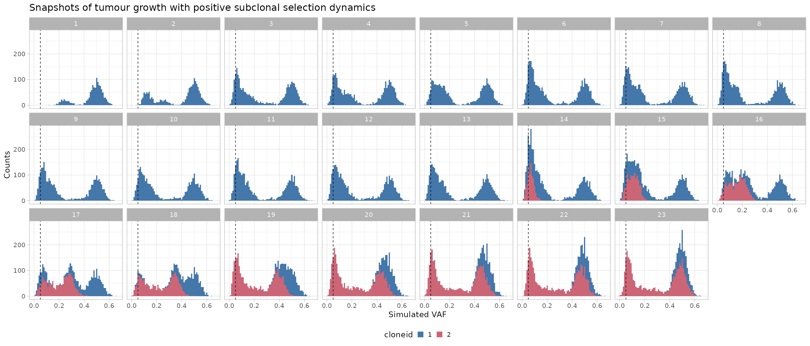
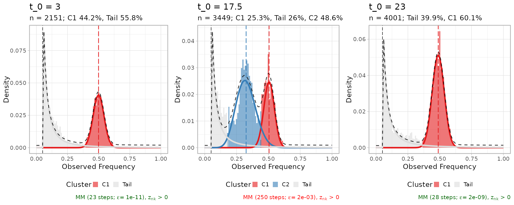

# 7. Visualizing subclonal expansions

[](https://t-heide.github.io/TEMULATOR/)

  

Stochastic branching processes models of tumour growth describe cell
division processes and the propagation of somatic alleles that accrue
during tumour evolution.

In this RMarkdown, we use these population genetics models to visualise
the joint effects of *neutral evolution* and *positive selection* on
sequencing data of tumour’s Variant Allele Frequencies (VAFs).

You can generate similar dynamics using the R package [Tumour Emulator
(TEMULATOR)](https://t-heide.github.io/TEMULATOR) or the Julia package
[CancerSeqSim](https://github.com/marcjwilliams1/CancerSeqSim).

## Simulated tumour growth

We have simulated a tumour with 2 clones. The tumours starts with the
ancestral clone at time `t = 0`, and the subclone with increased
positive selection relative to its ancestor ($s > 0$), emerging at time
`t = 9`.

We load the simulation object
[simulationdata.Rdata](https://caravagnalab.github.io/mobster/articles/simulationdata.Rdata).

``` r
library(mobster)
library(dplyr)
library(tibble)
library(ggplot2)
library(gganimate)

# Load input data from Marc
load('simulationdata.Rdata')

# Split by time point (`d` variable)
df.steps = split(df, f = df$d)

# Integer times
t_integers = df$d %>%  round() %>% unique %>% sort 

df = df %>% 
  as_tibble() %>%
  filter(d %in% t_integers) %>%
  mutate(cloneid = paste0(cloneid)) 

print(df %>% as_tibble)
#> # A tibble: 70,474 × 6
#>      VAF trueVAF cloneid cloneVAF     d popsize
#>    <dbl>   <dbl> <chr>      <dbl> <dbl>   <dbl>
#>  1 0.496     0.5 1              0     1       1
#>  2 0.459     0.5 1              0     1       1
#>  3 0.496     0.5 1              0     1       1
#>  4 0.5       0.5 1              0     1       1
#>  5 0.463     0.5 1              0     1       1
#>  6 0.460     0.5 1              0     1       1
#>  7 0.484     0.5 1              0     1       1
#>  8 0.474     0.5 1              0     1       1
#>  9 0.491     0.5 1              0     1       1
#> 10 0.505     0.5 1              0     1       1
#> # ℹ 70,464 more rows
```

We first use `gganimate` to create a GIF of the simulated data.

``` r
ani = df %>%
  as_tibble()  %>%
  mutate(cloneid = paste0(cloneid)) %>%
  ggplot(aes(x = VAF, fill = cloneid)) +
  geom_histogram(binwidth = 0.01) +
  gganimate::transition_states(
    d,
    transition_length = 2,
    state_length = 2
    ) +
  gganimate::ease_aes('cubic-in-out') +
  ylab("Counts (number of mutations)") +
  labs(
    title = 'Simulated VAF distribution',
    subtitle = 'Tumour doublings (clock): t = {closest_state}'
    ) +
  ggthemes::scale_fill_ptol() +
  mobster:::my_ggplot_theme()

gganimate::animate(ani,
                   width = 480,
                   height = 480,
                   units = "px",
                   res = 72,
                   nframes = 100,
                   renderer = gganimate::magick_renderer())
```



The time units of the plot are *genome doublings*. We have simulate
Poisson-distributed *whole-genome sequencing* (WGS) data at `120x`
median depth, and perfect tumour purity (`100%`). These parameters
affect the observable dynamics; here the subclone is visible after
`t = 14` doublings, and sweeps completely at `t = 19`.

We can plot the data distribution at each of a discrete set of
time-points.

``` r
df %>%
  ggplot(aes(x = VAF, fill = cloneid)) +
  geom_histogram(binwidth = 0.01) +
  theme_light() +
  facet_wrap( ~ d, nrow = 3) +
  geom_vline(xintercept = 0.05,
             linetype = 'dashed',
             size = .3) +
  labs(
    title = 'Snapshots of tumour growth with positive subclonal selection dynamics', 
    y = "Counts", 
    x = 'Simulated VAF'
    ) +
  CNAqc:::my_ggplot_theme() +
  ggthemes::scale_fill_ptol()
```


WGS data are simulated independently at each time-point, and the VAFs at
each point are therefore uncorrelated. The monoclonal ancestral
population is dark blue; mutations in the new subclone plus the
hitchikkers are coloured in purple.

The dynamics of the tumour span from time `t=0` to `t=23`; the subclone
is undetectable before `t=14`, and has sweeped through at the end of the
simulation.

## MOBSTER fits

We capture the dynamics (fit and plot) with a snapshot function `snap`.

``` r
snap = function(data, t, ...)
{
  x = data[[t]]
  x = x[x$VAF > 0.05,]
  
  time_label = paste0('t_0 = ', x$d[1])
  
  # Ellipsis to get what fits we want
  f = mobster_fit(x, description = time_label, ...)$best
  
  return(list(fit = f, plot = plot(f) + labs(title = time_label)))
}

# Initial clone (monoclonal)
initiation = snap(data = df.steps, t = 5, K = 1, samples = 1, parallel = FALSE)
#>  [ MOBSTER fit ] 
#> 
#> ✔ Loaded input data, n = 2151.
#> ❯ n = 2151. Mixture with k = 1 Beta(s). Pareto tail: TRUE and FALSE. Output
#> clusters with π > 0.02 and n > 10.
#> ❯ Custom fit by Moments-matching in up to 250 steps, with ε = 1e-10 and peaks
#> initialisation.
#> ❯ Scoring (without parallel) 1 x 1 x 2 = 2 models by reICL.
#> ℹ MOBSTER fits completed in 641ms.
#> ── [ MOBSTER ] t_0 = 3 n = 2151 with k = 1 Beta(s) and a tail ──────────────────
#> ● Clusters: π = 56% [Tail] and 44% [C1], with π > 0.
#> ● Tail [n = 1156, 56%] with alpha = 1.2.
#> ● Beta C1 [n = 995, 44%] with mean = 0.5.
#> ℹ Score(s): NLL = -1885.56; ICL = -3543.5 (-3725.09), H = 181.58 (0). Fit
#> converged by MM in 23 steps.

# Ongoing subclonal expansion (polyclonal)
selection =  snap(data = df.steps, t = 34, K = 2, samples = 1, parallel = FALSE) 
#>  [ MOBSTER fit ] 
#> 
#> ✔ Loaded input data, n = 3449.
#> ❯ n = 3449. Mixture with k = 2 Beta(s). Pareto tail: TRUE and FALSE. Output
#> clusters with π > 0.02 and n > 10.
#> ❯ Custom fit by Moments-matching in up to 250 steps, with ε = 1e-10 and peaks
#> initialisation.
#> ❯ Scoring (without parallel) 1 x 1 x 2 = 2 models by reICL.
#> ℹ MOBSTER fits completed in 13.8s.
#> ── [ MOBSTER ] t_0 = 17.5 n = 3449 with k = 2 Beta(s) and a tail ───────────────
#> ● Clusters: π = 49% [C2], 26% [Tail], and 25% [C1], with π > 0.
#> ● Tail [n = 805, 26%] with alpha = 1.2.
#> ● Beta C1 [n = 967, 25%] with mean = 0.51.
#> ● Beta C2 [n = 1677, 49%] with mean = 0.33.
#> ℹ Score(s): NLL = -2141.74; ICL = -3177.42 (-3783.36), H = 1032.76 (426.82).
#> Fit interrupted by MM in 250 steps.

# Sweeped clone (monoclonal)
sweep =  snap(data = df.steps, t = length(df.steps), K = 1, samples = 1, parallel = FALSE) 
#>  [ MOBSTER fit ] 
#> 
#> ✔ Loaded input data, n = 4001.
#> ❯ n = 4001. Mixture with k = 1 Beta(s). Pareto tail: TRUE and FALSE. Output
#> clusters with π > 0.02 and n > 10.
#> ❯ Custom fit by Moments-matching in up to 250 steps, with ε = 1e-10 and peaks
#> initialisation.
#> ❯ Scoring (without parallel) 1 x 1 x 2 = 2 models by reICL.
#> ℹ MOBSTER fits completed in 1.4s.
#> ── [ MOBSTER ] t_0 = 23 n = 4001 with k = 1 Beta(s) and a tail ─────────────────
#> ● Clusters: π = 60% [C1] and 40% [Tail], with π > 0.
#> ● Tail [n = 1530, 40%] with alpha = 1.1.
#> ● Beta C1 [n = 2471, 60%] with mean = 0.49.
#> ℹ Score(s): NLL = -3417.33; ICL = -6427.2 (-6784.89), H = 357.69 (0). Fit
#> converged by MM in 28 steps.

cowplot::plot_grid(initiation$plot, selection$plot, sweep$plot, nrow = 1)
```



Notice that the tail at the end of the simulation is now mostly
dominated by the progeny of the most recent clone, and the amount of
mutations in the tail and the clonal cluster is balanced as in the
beginning of the simulation. This because in this simulation the
mutation rate of the tumour is the same across all simulated clones.
