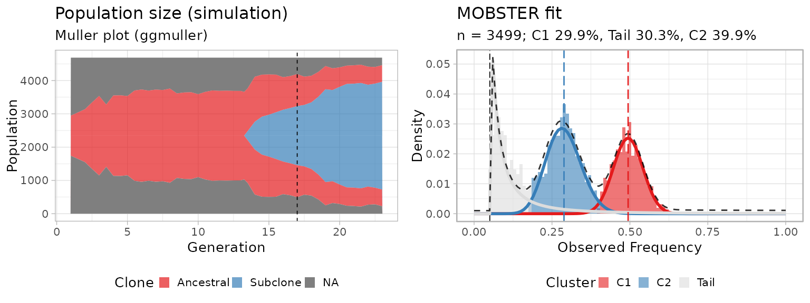

# mobster

  

`mobster` implements a Dirichlet finite mixture model to detect ongoing
positive subclonal selection from cancer genome sequencing data. The
algorithm works best with high-resolution whole-genome sequencing data
(e.g., WGS `>100x`). The models performs a deconvolution of the site/
allele frequency spectrum of mutation data (the *signal*), and looks for
models with `k+1` mixture components to fit the data (`k` subclones).

The plot shows the fit (right) of a simulated subclonal expansion (left,
Muller plot with
[ggmuller](https://cran.r-project.org/web/packages/ggmuller/vignettes/ggmuller.html));
`C2`, the subclone at `~30%` allelic frequency is outgrowing an
ancestral clonal population `C1`, at `~50%` allelic frequency
(heterozygous mutations). Their dynamics are consistent with what we
[expect from the interplay of positive selection between clones and
neutral evolution within each
clone](https://caravagnalab.github.io/mobster/articles/Example_tumour_simulation.html).

Inspired from both *mathematical modelling of evolutionary processes*
and *Machine Learning*, the signal is modeled as mixture density with
two types of distributions:

- `k` Betas to capture the peaks of alleles raising up in frequency in
  different clones (subclones enjoying positive selection, and the
  clonal cluster);
- `1` Pareto Type-I power law to model within-clone neutral dynamics,
  which is the distribution predicted by theoretical Population
  Genetics.

`mobster` fits can be computed via *moment-matching* (default) or
*maximum-likelihood*, the former being much faster Model selection for
the number of components can be done with multiple likelihood-based
scores such as the BIC, and its entropy-based extensions ICL and reICL,
a new variation to ICL with reduced-entropy.

S3 objects are defined to perform easy visualization of the data and aid
comparison of different fits; *parametric* and *non-parametric
bootstrap* routines are also available to assess the confidence of each
parameter (bootstrap quantiles) and the model (overall model frequency).

This is a *model-based* approach to analyse cancer data, meaning that a
power law tail is used to integrate evolutionary dynamics in this
traditional clustering problem. Results from `mobster` deconvolution can
be used to reconstruct the clonal architecture of a tumour (*subclonal
deconvolution*) and identify patterns of functional heterogeneity
(subclones under positive selection).

A number of
[vignettes](https://caravagnalab.github.io/mobster/articles/) are
available to help you using `mobster`; for a set of real case studies
check out the Supplementary Data repository hosted at the [Sottoriva Lab
Github page](https://github.com/sottorivalab)
