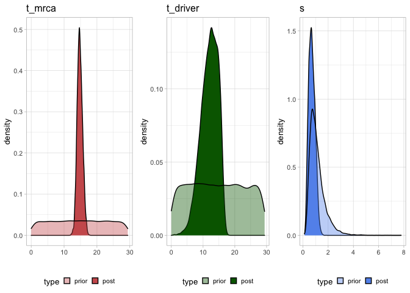

4. Population Genetics statistics
================
Giulio Caravagna
13 Giugno, 2023

``` r
library(mobster)
library(tidyr)
library(dplyr)
```

Population Genetics statistics can be extracted from a MOBSTER model.

``` r
data('fit_example', package = 'mobster')
print(fit_example$best)
#> ── [ MOBSTER ] My MOBSTER model n = 5000 with k = 2 Beta(s) and a tail ─────────
#> ● Clusters: π = 55% [C1], 31% [Tail], and 14% [C2], with π > 0.
#> ● Tail [n = 1370, 31%] with alpha = 1.2.
#> ● Beta C1 [n = 2784, 55%] with mean = 0.48.
#> ● Beta C2 [n = 846, 14%] with mean = 0.15.
#> ℹ Score(s): NLL = -5671.5; ICL = -10359.09 (-11266.35), H = 907.26 (0). Fit
#> converged by MM in 75 steps.

evolutionary_parameters(fit_example)
#> # A tibble: 1 × 7
#>      mu exponent  time subclonefrequency subclonemutations cluster     s
#>   <dbl>    <dbl> <dbl>             <dbl>             <dbl> <chr>   <dbl>
#> 1  73.5     2.25  5.98             0.298              695. C2      0.177
```

The mutation rate `mu` (cell division units) scaled by the probability
of lineage survival $\beta$, $\mu/\beta$, is given by: $$
\mu/\beta = \dfrac{M} {(\frac{1}{f_\text{min}} - \frac{1}{f_\text{max}})}
$$ Where $f_\text{min}$ is the minimum VAF and $f_\text{max}$ is the
maximum, and $M$ is the number of mutations between $f_\text{min}$ and
$f_\text{max}$.

Selection is defined as the relative growth rates of host tumor cell
populations ($\lambda h$) vs subclone ($\lambda s$): $$
1+s= \dfrac{\lambda h}{ \lambda s}
$$

The mathematical details of these computations are described in the main
paper, and based on the population genetics model of tumour evolution in
Williams et al. 2016 and 2018 (Nature Genetics).

``` r
N_max = 10^9
mobster:::s_posterior(fit_example,N_max,ncells = 2, u = 0, sigma = 0.5)
#> Caricamento del pacchetto richiesto: StanHeaders
#> Caricamento del pacchetto richiesto: ggplot2
#> rstan (Version 2.21.7, GitRev: 2e1f913d3ca3)
#> For execution on a local, multicore CPU with excess RAM we recommend calling
#> options(mc.cores = parallel::detectCores()).
#> To avoid recompilation of unchanged Stan programs, we recommend calling
#> rstan_options(auto_write = TRUE)
#> 
#> Caricamento pacchetto: 'rstan'
#> Il seguente oggetto è mascherato da 'package:tidyr':
#> 
#>     extract
#> Using type as id variables
#> ✔ Loading CNAqc, 'Copy Number Alteration quality check'. Support : <]8;;https://caravagn.github.io/CNAqc/https://caravagn.github.io/CNAqc/]8;;>
#> Using type as id variables
#> Using type as id variables
#> $posterior
#> Inference for Stan model: a9566cea8cba35098d4c4359e1009378.
#> 4 chains, each with iter=5000; warmup=1000; thin=1; 
#> post-warmup draws per chain=4000, total post-warmup draws=16000.
#> 
#>             mean se_mean   sd    2.5%     25%     50%     75%   97.5% n_eff
#> t_mrca     14.81    0.02 0.81   13.31   14.24   14.76   15.35   16.48  2937
#> t_driver   12.00    0.05 2.66    6.27   10.22   12.27   14.08   16.15  2487
#> s           0.71    0.00 0.25    0.29    0.52    0.69    0.88    1.22  2527
#> lp__     4834.66    0.02 1.35 4831.19 4834.05 4835.02 4835.64 4836.20  3630
#>          Rhat
#> t_mrca      1
#> t_driver    1
#> s           1
#> lp__        1
#> 
#> Samples were drawn using NUTS(diag_e) at Tue Jun 13 17:24:08 2023.
#> For each parameter, n_eff is a crude measure of effective sample size,
#> and Rhat is the potential scale reduction factor on split chains (at 
#> convergence, Rhat=1).
#> 
#> $plot
```

<!-- -->

A posterior distribution of time of origin $t_{driver}$, time of mrca
appearance $t_{mrca}$ and selection coefficient $s$ of a subclone. We
assume a Poisson distribution as likelihood for the number of diploid
heterozygous mutations of the subclonal cluster with mean
$M = 2\mu l\omega(t_{driver} + (1+s)(t_{mrca} - t_{driver}))$,where $l$
is the length of the diploid genome, $\mu$ is the mutation rate and
$\omega$ is the growth rate of the tumour. We assume an exponential
distribution as likelihood for the mean number of cells of the subclone.
The rate of the exponential is the inverse of expected subclone size
$exp(-\omega(T-t_{driver}))$, where $T$ is the time of sample
collection. Times and growth rate are expressed in tumor doubling units.
Posterior distributions are computed with HMC using RSTAN.
