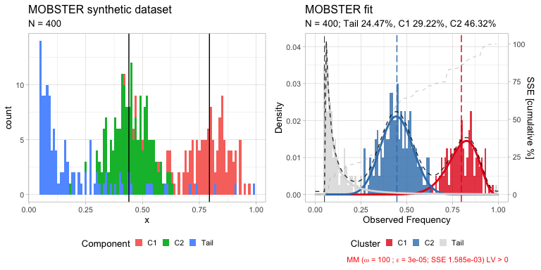
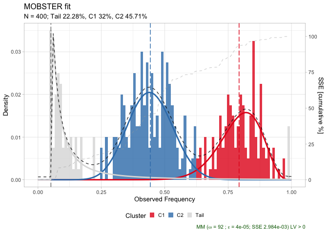
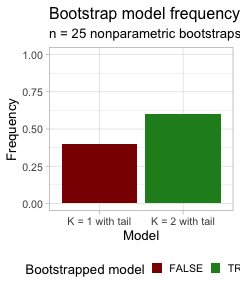
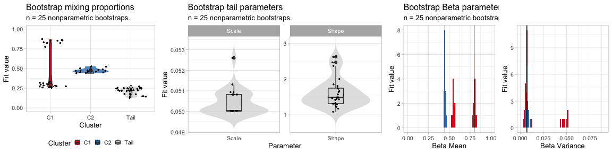
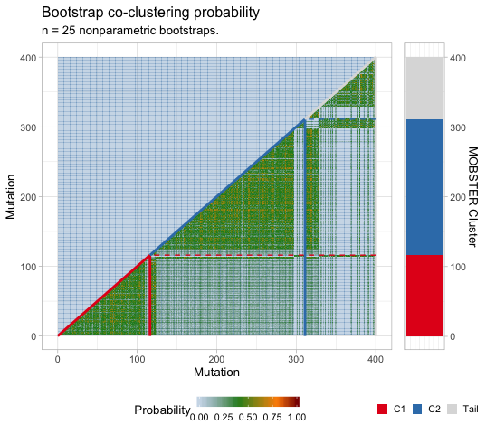

Confidence estimation via the bootstrap
================
Giulio Caravagna
September 2019

This vignette describes how to compute the *bootstrap* confidence of a
MOBSTER model.

The MOBSTER R package is available at
[Github](https://github.com/caravagn/MOBSTER).

``` r
library(mobster)
```

## Bootstrapping a model

There are two types of bootstrap functions available in MOBSTER:
*parametric* and *nonparametric*.

  - The former samples data from the model, and re-runs the fits;
  - the latter re-samples the data (with repetitions), and re-runs the
    fits.

In both cases a distribution of the parameter fits can be approximated,
and in the case of nonparametric bootstrap also the probability of
clustering together two mutations can be computed.

To speed up the computation we show this with a smaller dataset.

``` r
# Data generation
dataset = random_dataset(
  N = 400, 
  seed = 123, 
  Beta_variance_scaling = 100
  )

# Fit model -- FAST option to speed up the vignette
fit = mobster_fit(dataset$data, auto_setup = 'FAST')
#>  [ MOBSTER fit ]

# Composition with cowplot
figure = cowplot::plot_grid(
  dataset$plot, 
  plot(fit$best), 
  ncol = 2, 
  align = 'h')

print(figure)
```

<!-- -->

Now we are ready to compute `n.resamples` nonparametric bootstraps, and
the bootstrapped statistics. We can do that using function
`mobster_bootstrap` to which we can pass some parameters that will be
forwarded to the calls of `mobster_fit`

``` r
options(easypar.parallel = FALSE)

# The returned object contains also the list of bootstrap resamples, and the fits.
bootstrap_results = mobster_bootstrap(
  fit$best,
  bootstrap = 'nonparametric',
  n.resamples = 25,
  auto_setup = 'FAST' # forwarded to mobster_fit
  )
#>  [ MOBSTER bootstrap ~ 25 resamples from nonparametric bootstrap ] 
#> 
#> 
#> 
#> 
#>  [ MOBSTER fit ] 
#> 
#> 
#> 
#> 
#> 
#>  [ MOBSTER fit ] 
#> 
#> 
#> 
#> 
#> 
#>  [ MOBSTER fit ] 
#> 
#> 
#> 
#> 
#> 
#>  [ MOBSTER fit ] 
#> 
#> 
#> 
#> 
#> 
#>  [ MOBSTER fit ] 
#> 
#> 
#> 
#> 
#> 
#>  [ MOBSTER fit ] 
#> 
#> 
#> 
#> 
#> 
#>  [ MOBSTER fit ] 
#> 
#> 
#> 
#> 
#> 
#>  [ MOBSTER fit ] 
#> 
#> 
#> 
#> 
#> 
#>  [ MOBSTER fit ] 
#> 
#> 
#> 
#> 
#> 
#>  [ MOBSTER fit ] 
#> 
#> 
#> 
#> 
#> 
#>  [ MOBSTER fit ] 
#> 
#> 
#> 
#> 
#> 
#>  [ MOBSTER fit ] 
#> 
#> 
#> 
#> 
#> 
#>  [ MOBSTER fit ] 
#> 
#> 
#> 
#> 
#> 
#>  [ MOBSTER fit ] 
#> 
#> 
#> 
#> 
#> 
#>  [ MOBSTER fit ] 
#> 
#> 
#> 
#> 
#> 
#>  [ MOBSTER fit ] 
#> 
#> 
#> 
#> 
#> 
#>  [ MOBSTER fit ] 
#> 
#> 
#> 
#> 
#> 
#>  [ MOBSTER fit ] 
#> 
#> 
#> 
#> 
#> 
#>  [ MOBSTER fit ] 
#> 
#> 
#> 
#> 
#> 
#>  [ MOBSTER fit ] 
#> 
#> 
#> 
#> 
#> 
#>  [ MOBSTER fit ] 
#> 
#> 
#> 
#> 
#> 
#>  [ MOBSTER fit ] 
#> 
#> 
#> 
#> 
#> 
#>  [ MOBSTER fit ] 
#> 
#> 
#> 
#> 
#> 
#>  [ MOBSTER fit ] 
#> 
#> 
#> 
#> 
#> 
#>  [ MOBSTER fit ]
```

The output object contains all the relevant information to analyze the
results of this computation, which include the bootstrap resamples, the
fits and possible errors.

``` r
# Resamples are available for inspection as list of lists, 
# with a mapping to record the mutation id of the resample data.
# Ids are row numbers.
print(bootstrap_results$resamples[[1]][[1]] %>% as_tibble())
#> # A tibble: 400 x 3
#>       id    VAF original.id
#>    <int>  <dbl>       <int>
#>  1     1 0.877           10
#>  2     2 0.965           58
#>  3     3 0.791           77
#>  4     4 0.715           98
#>  5     5 0.270          338
#>  6     6 0.405          174
#>  7     7 0.482          129
#>  8     8 0.0691         361
#>  9     9 0.270          338
#> 10    10 0.829           93
#> # … with 390 more rows

# Fits are available inside the $fits list
print(bootstrap_results$fits[[1]])
#> ── [ MOBSTER ] My MOBSTER model n = 400 with k = 2 Beta(s) and a tail ─────────────────────────────────────────────────
#> ● Clusters: π = 46% [C2], 32% [C1] and 22% [Tail], with π > 0.
#> ● Tail [n = 77, 22%] with alpha = 1.1.
#> ● Beta C1 [n = 129, 32%] with mean = 0.79.
#> ● Beta C2 [n = 194, 46%] with mean = 0.44.
#> ℹ Score(s): NLL = -76.38; ICL = -28.36 (-77.8), H = 70.48 (21.03). Fit converged by MM in 92 steps.
plot(bootstrap_results$fits[[1]])
```

<!-- -->

``` r

# If any the computations raised an erorr, they will be stored 
# inside %errors rather than $fits
print(bootstrap_results$errors)
#> NULL
```

## Bootstrap statistics

Bootstrap statistics can be computed with MOBSTER function
`bootstrapped_statistics`.

The time to compute these stats depends on the number of mutations in
the data, and the number of bootstrap resamples. In case of a
`nonparmaetric` bootstrap `bootstrapped_statistics` computes also the
data co-clustering probability, defined as the probability of any pair
of mutations in the data to be clustered together across resamples. This
statistics is the one that takes most time, as it its complexity scales
as `N * N * B` with `N` mutations and `B` bootstrap resamples.

> Note that this probability depends on the joint resample probability
> of each pair of mutations, which is computable because samples are
> independent and uniform, and therefore each mutation is bootstrapped
> with probability
1/N.

``` r
# This function plots also to screen a bunch of statistics that are also returned
bootstrap_statistics = bootstrapped_statistics(
  fit$best, 
  bootstrap_results = bootstrap_results
  )
#> ℹ Bootstrap observations n = 25
#> ℹ Computing model frequency
#> # A tibble: 2 x 3
#>   Model           Frequency fit.model
#>   <fct>               <dbl> <lgl>    
#> 1 K = 2 with tail       0.6 TRUE     
#> 2 K = 1 with tail       0.4 FALSE
#>                            ✓ Computing model frequency ... done
#> ℹ Confidence Intervals (CI) for empirical quantiles
#> 
#> Mixing proportions 
#>  # A tibble: 3 x 8
#>   cluster statistics   min lower_quantile higher_quantile   max fit.value
#>   <chr>   <chr>      <dbl>          <dbl>           <dbl> <dbl>     <dbl>
#> 1 C1      Mixing pr… 0.256          0.258           0.866 0.873     0.292
#> 2 C2      Mixing pr… 0.440          0.441           0.526 0.527     0.463
#> 3 Tail    Mixing pr… 0.127          0.134           0.263 0.273     0.245
#> # … with 1 more variable: init.value <dbl>
#> 
#> Tail shape/ scale 
#>  # A tibble: 2 x 8
#>   cluster statistics    min lower_quantile higher_quantile    max fit.value
#>   <chr>   <chr>       <dbl>          <dbl>           <dbl>  <dbl>     <dbl>
#> 1 Tail    Scale      0.0500         0.0500          0.0518 0.0526    0.0500
#> 2 Tail    Shape      1.08           1.14            2.53   2.62      1.25  
#> # … with 1 more variable: init.value <dbl>
#> 
#> Beta peaks 
#>  # A tibble: 4 x 8
#>   cluster statistics     min lower_quantile higher_quantile    max fit.value
#>   <chr>   <chr>        <dbl>          <dbl>           <dbl>  <dbl>     <dbl>
#> 1 C1      Mean       0.526          0.532            0.818  0.824    0.798  
#> 2 C1      Variance   0.00356        0.00416          0.0514 0.0517   0.00664
#> 3 C2      Mean       0.431          0.432            0.464  0.467    0.446  
#> 4 C2      Variance   0.00540        0.00556          0.0104 0.0109   0.00731
#> # … with 1 more variable: init.value <dbl>
#>                                                    ✓ Confidence Intervals (CI) for empirical quantiles ... done
#> ℹ Co-clustering probability from nonparametric bootstrap                                                        ✓ Co-clustering probability from nonparametric bootstrap ... done
```

Object `bootstrap_statistics` contains several tibbles that aggregate
the data, and for each one of them there is a MOBSTER function to plot
the data.

``` r
# All bootstrapped values
print(bootstrap_statistics$bootstrap_values)
#> # A tibble: 325 x 5
#>    cluster statistics fit.value init.value resample
#>    <chr>   <chr>          <dbl>      <dbl>    <int>
#>  1 Tail    Shape        1.08       1.14           1
#>  2 Tail    Scale        0.0508     0.0508         1
#>  3 Tail    Mean         0.670      0.414          1
#>  4 Tail    Variance   Inf        Inf              1
#>  5 C2      a           14.0       20.4            1
#>  6 C2      b           17.6       20.4            1
#>  7 C2      Mean         0.443      0.645          1
#>  8 C2      Variance     0.00757    0.00702        1
#>  9 C1      a           18.6       16.5            1
#> 10 C1      b            4.84      16.5            1
#> # … with 315 more rows

# The model probability
print(bootstrap_statistics$bootstrap_model)
#> # A tibble: 2 x 3
#>   Model           Frequency fit.model
#>   <fct>               <dbl> <lgl>    
#> 1 K = 2 with tail       0.6 TRUE     
#> 2 K = 1 with tail       0.4 FALSE

# The parameter stastics
print(bootstrap_statistics$bootstrap_statistics)
#> # A tibble: 15 x 8
#>    cluster statistics     min lower_quantile higher_quantile      max fit.value
#>    <chr>   <chr>        <dbl>          <dbl>           <dbl>    <dbl>     <dbl>
#>  1 C1      a          2.08e+0        2.11            29.4     35.4     18.6    
#>  2 C1      b          1.69e+0        1.70             6.89     9.04     4.69   
#>  3 C1      Mean       5.26e-1        0.532            0.818    0.824    0.798  
#>  4 C1      Mixing pr… 2.56e-1        0.258            0.866    0.873    0.292  
#>  5 C1      Variance   3.56e-3        0.00416          0.0514   0.0517   0.00664
#>  6 C2      a          9.32e+0       10.2             19.2     19.8     14.6    
#>  7 C2      b          1.23e+1       12.7             24.2     24.9     18.2    
#>  8 C2      Mean       4.31e-1        0.432            0.464    0.467    0.446  
#>  9 C2      Mixing pr… 4.40e-1        0.441            0.526    0.527    0.463  
#> 10 C2      Variance   5.40e-3        0.00556          0.0104   0.0109   0.00731
#> 11 Tail    Mean       8.09e-2        0.0829           0.477    0.670    0.247  
#> 12 Tail    Mixing pr… 1.27e-1        0.134            0.263    0.273    0.245  
#> 13 Tail    Scale      5.00e-2        0.0500           0.0518   0.0526   0.0500 
#> 14 Tail    Shape      1.08e+0        1.14             2.53     2.62     1.25   
#> 15 Tail    Variance   4.04e-3        0.00533        Inf      Inf      Inf      
#> # … with 1 more variable: init.value <dbl>
```

Bootstrapping, one can plot the model probability across re-samples as a
barplot

``` r
plot_bootstrap_model_frequency(
  bootstrap_results, 
  bootstrap_statistics
  )
```

<!-- -->

Similarly, one can compute the parameter probabilities across
re-samples, which we here aggregate as a figure.

``` r
# Plot the mixing proportions
mplot = plot_bootstrap_mixing_proportions(
  fit$best, 
  bootstrap_results = bootstrap_results, 
  bootstrap_statistics = bootstrap_statistics
  )

# Plot the tail parameters
tplot = plot_bootstrap_tail(
  fit$best, 
  bootstrap_results = bootstrap_results, 
  bootstrap_statistics = bootstrap_statistics
  )

# Plot the Beta parameters
bplot = plot_bootstrap_Beta(
  fit$best, 
  bootstrap_results = bootstrap_results, 
  bootstrap_statistics = bootstrap_statistics
  )
#> Warning: Removed 4 rows containing missing values (geom_bar).

#> Warning: Removed 4 rows containing missing values (geom_bar).

# Figure
figure = ggarrange(
  mplot,
  tplot,
  bplot,
  ncol = 3, nrow = 1,
  widths = c(.7, 1, 1)
)

print(figure)
```

<!-- -->

Bcause this is a nonparametric bootstrap run, the co-clustering
probability can be plot as well

``` r

plot_bootstrap_coclustering(
  fit$best, 
  bootstrap_results = bootstrap_results, 
  bootstrap_statistics = bootstrap_statistics
  )
```

<!-- -->
