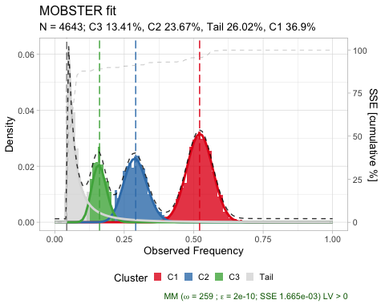
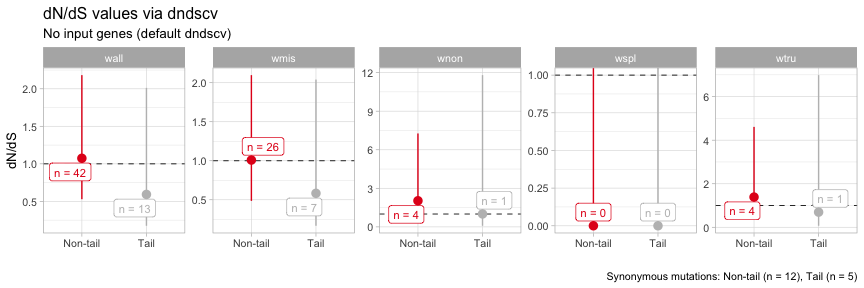
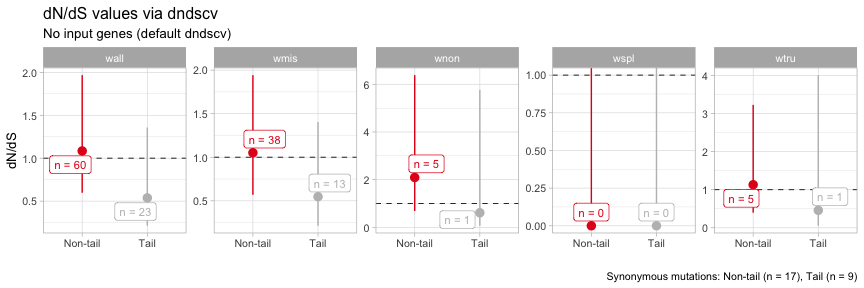

Evolutionary analyses of mobster fits
================
Giulio Caravagna
September 2019

This vignette describes the evolutionary analyses that are available in
[MOBSTER](https://github.com/caravagn/MOBSTER), and include:

  - computation of dnds values via the package `dndscv`;
  - computation of evolutionary parameters;

<!-- end list -->

``` r
library(mobster)
```

## Computing dnds values

Dn/Ds values are computed wrapping a call to the
[dndscv](https://github.com/im3sanger/dndscv/) R package, developed by
Martincorena at Sanger.

> Martincorena, et al. “Universal patterns of selection in cancer and
> somatic tissues.” Cell 171.5 (2017): 1029-1041.

These values can only be computed if the available mutation calls have
the following information:

  - the chromosome location, labelled as `chrom`;
  - the mutation position, labelled as `from`;
  - the mutant and the reference alleles, labelled as `alt` and `ref`.

To show these analysis we use the fits for the `PD4120a` breast cancer
sample available in MOBSTER.

``` r
data('PD4120a_breast_sample', package = 'mobster')

# Print and plot the model
print(PD4120a_breast_sample$best)
#> ── [ MOBSTER ]  n = 4643 with k = 3 Beta(s) and a tail ────────────────────────────────────────────────────────────────
#> ● Clusters: π = 37% [C2], 26% [Tail], 24% [C1] and 13% [C3], with π > 0.
#> ● Tail [n = 1006, 26%] with alpha = 1.5.
#> ● Beta C1 [n = 1740, 37%] with mean = 0.52.
#> ● Beta C2 [n = 1167, 24%] with mean = 0.29.
#> ● Beta C3 [n = 730, 13%] with mean = 0.16.
#> ℹ Score(s): NLL = -3201.73; ICL = -5346.89 (-6113.83), H = 955.25 (188.31). Fit converged by MM in 259 steps.
plot(PD4120a_breast_sample$best)
```

<!-- -->

To compute the values one first extracts the clustering assignments from
the best fit.

``` r
clusters = Clusters(PD4120a_breast_sample$best)
pio::pioDisp(clusters)
#> # A tibble: 4,643 x 19
#>    region gene  chr     from     to ref   alt   vartype VAF.tumour VAF.normal
#>    <chr>  <chr> <chr>  <int>  <int> <chr> <chr> <chr>        <dbl>      <dbl>
#>  1 inter… LOC1… chr3   74574  74574 G     A     SNP          0.371          0
#>  2 inter… LOC1… chr3   80489  80489 C     T     SNP          0.276          0
#>  3 inter… LOC1… chr3  139091 139091 G     C     SNP          0.049          0
#>  4 inter… LOC1… chr3  150557 150557 G     C     SNP          0.077          0
#>  5 inter… LOC1… chr3  190860 190860 T     A     SNP          0.033          0
#>  6 inter… LOC1… chr3  198896 198896 C     G     SNP          0.347          0
#>  7 inter… LOC1… chr3  234298 234298 C     T     SNP          0.233          0
#>  8 intro… CHL1  chr3  271958 271958 C     G     SNP          0.282          0
#>  9 intro… CHL1  chr3  312028 312028 C     T     SNP          0.083          0
#> 10 intro… CHL1  chr3  321624 321624 C     T     SNP          0.162          0
#> # … with 4,633 more rows, and 9 more variables: depth.tumour <dbl>,
#> #   depth.normal <chr>, NV <dbl>, VAF <dbl>, cluster <chr>, Tail <dbl>,
#> #   C1 <dbl>, C2 <dbl>, C3 <dbl>
```

The available clusters are `C1`, `C2`, `C3` and `Tail`; `C1` is the
clonal cluster and `C2` and `C3` are subclones.

To compute the dnds statistics one has to define a custom grouping on
top of the actual clusters, so that the statistics are computed by
group.

Groups are defined from a `mapping` variable.

> If `mapping = c(`C1`= 'G1',`C2`= 'G1',`C3`= 'G1',`Tail`= 'G2')`, then
> mutations from clusters `C1`, `C2` and `C3` will be pooled into one
> group (`G1`), while mutations from cluster `Tail` will constitute a
> group themselves. By default, with `mapping = NULL`, each cluster is a
> group.

One can now run the analysis using this grouping and the default gene
list (`gene_list = NULL`) available in `dndscv`.

``` r
# Run with this grouping and default gene list
dnds_stats = dnds(
  clusters,
  mapping = c(`C1` = 'Non-tail', `C2` = 'Non-tail', `C3` = 'Non-tail', `Tail` = 'Tail'),
  gene_list = NULL
)
#> 
#> =-=-=-=-=-=-=-=-=-=-=-=-=-=-=-=-=-=-=-=-=-=-
#>  MOBSTER wrapper for dndscv version 0.0.1.0
#> =-=-=-=-=-=-=-=-=-=-=-=-=-=-=-=-=-=-=-=-=-=-
#> Missing sample column.
#> > Assuming these are mutations from a single patient, adding dummy sample id.
#> > If this is not the case, label each mutation with a sample id.
#> 
#>   Mutations  4643 
#>       Genes  0 
#>    Clusters  4 
#>     Samples  0 
#> Dnds groups  2 
#> 
#> [refdb = hg19] 
#> > Removing chr from chromosome names for hg19 reference compatability
#> Mapping clusters to dnds_groups
#>   
#> Non-tail     Tail 
#>     3637     1006 
#> 
#> =-=-=-=-=-=-=-=-
#>  Running dndscv
#> =-=-=-=-=-=-=-=-
#> 
#> dndscv @ dnds_group  Non-tail 
#> 
#> [1] Loading the environment...
#> [2] Annotating the mutations...
#> [3] Estimating global rates...
#> [4] Running dNdSloc...
#> [5] Running dNdScv...
#>     Regression model for substitutions (theta = 5.47).
#> 
#> dndscv @ dnds_group  Tail 
#> 
#> [1] Loading the environment...
#> [2] Annotating the mutations...
#> [3] Estimating global rates...
#> [4] Running dNdSloc...
#> [5] Running dNdScv...
#>     Regression model for substitutions (theta = 0.000125).
#> Results: wall, wmis, wnon, wspl, wtru 
#>  # A tibble: 10 x 5
#>    name           mle  cilow cihigh dnds_group
#>    <chr>        <dbl>  <dbl>  <dbl> <chr>     
#>  1 wmis  1.01         0.485    2.10 Non-tail  
#>  2 wnon  2.03         0.569    7.27 Non-tail  
#>  3 wspl  0.0000000298 0      Inf    Non-tail  
#>  4 wtru  1.39         0.417    4.61 Non-tail  
#>  5 wall  1.07         0.528    2.18 Non-tail  
#>  6 wmis  0.583        0.166    2.04 Tail      
#>  7 wnon  1.01         0.0860  11.8  Tail      
#>  8 wspl  0.0000000227 0      Inf    Tail      
#>  9 wtru  0.696        0.0694   6.99 Tail      
#> 10 wall  0.592        0.174    2.01 Tail      
#> Generating ouptut plot 
#> 
```

The returned outputs are the tables returned by `dndscv`, as well as a
`ggplot` plot for the object. The column `dnds_group` labels the group
used to compute the statistics.

``` r
# Summary statistics
print(dnds_stats$dnds_summary)
#> # A tibble: 10 x 5
#>    name           mle  cilow cihigh dnds_group
#>    <chr>        <dbl>  <dbl>  <dbl> <chr>     
#>  1 wmis  1.01         0.485    2.10 Non-tail  
#>  2 wnon  2.03         0.569    7.27 Non-tail  
#>  3 wspl  0.0000000298 0      Inf    Non-tail  
#>  4 wtru  1.39         0.417    4.61 Non-tail  
#>  5 wall  1.07         0.528    2.18 Non-tail  
#>  6 wmis  0.583        0.166    2.04 Tail      
#>  7 wnon  1.01         0.0860  11.8  Tail      
#>  8 wspl  0.0000000227 0      Inf    Tail      
#>  9 wtru  0.696        0.0694   6.99 Tail      
#> 10 wall  0.592        0.174    2.01 Tail

# Table observation countns
print(dnds_stats$dndscv_table)
#> # A tibble: 40,182 x 15
#>    gene_name n_syn n_mis n_non n_spl wmis_cv wnon_cv wspl_cv pmis_cv ptrunc_cv
#>    <chr>     <dbl> <dbl> <dbl> <dbl>   <dbl>   <dbl>   <dbl>   <dbl>     <dbl>
#>  1 CNTN4         0     1     1     0    507.   3544.   3544. 1.36e-3 0.000170 
#>  2 P4HTM         0     0     1     0      0   11135.  11135. 9.67e-1 0.0000506
#>  3 PRSS46        0     1     0     0   4274.      0       0  1.39e-4 0.992    
#>  4 SPICE1        1     0     1     0      0    2859.   2859. 9.42e-1 0.000209 
#>  5 C3orf56       0     1     0     0   2721.      0       0  2.25e-4 0.993    
#>  6 CISH          0     1     0     0   2426.      0       0  2.54e-4 0.995    
#>  7 TMEM45A       0     1     0     0   1871.      0       0  3.36e-4 0.991    
#>  8 PLSCR1        0     1     0     0   1798.      0       0  3.50e-4 0.987    
#>  9 LMCD1         0     1     0     0   1757.      0       0  3.59e-4 0.991    
#> 10 DNAJC13       0     0     1     0      0    1711.   1711. 9.23e-1 0.000369 
#> # … with 40,172 more rows, and 5 more variables: pallsubs_cv <dbl>,
#> #   qmis_cv <dbl>, qtrunc_cv <dbl>, qallsubs_cv <dbl>, dnds_group <chr>

# Plot
print(dnds_stats$plot)
```

<!-- -->

By default, the plot contains all the results from the substitution
models availavle in `dndscv`. If one wants to visualize only the global
dnds score parameter `dndscv_plot` should be set to `wall` in the call
to `dnds()`.

### Using custom genes lists

A custom list of genes can be supplied in the call to `dnds()` as the
variable `genes_list`.

MOBSTER provides 4 lists of interests for this type of computation:

  - a list of driver genes compiled in `Martincorena et al. Cell 171.5
    (2017): 1029-1041.`;
  - a list of driver genes compiled in `Tarabichi, et al. Nature
    Genetics 50.12 (2018): 1630.`;
  - a list of essential genes compiled in `Wang et al. Science 350.6264
    (2015): 1096-1101.`;
  - a list of essential genes compiled in `Bloomen et al.
    Science 350.6264 (2015): 1092-1096.`.

which are available to load.

``` r
# Load the list
data('cancer_genes_dnds', package = 'mobster')

# Each sublist is a list 
print(lapply(cancer_genes_dnds, head))
#> $Martincorena_drivers
#> [1] "CCDC6"     "EIF1AX"    "HIST1H2BD" "MED12"     "POLE"      "SMARCB1"  
#> 
#> $Tarabichi_drivers
#> [1] "ACVR1"  "ACVR1B" "AKT1"   "ALK"    "AMER1"  "APC"   
#> 
#> $Wang_essentials
#> [1] "ABL1"    "RPL23A"  "AARS2"   "TRMT112" "FARSA"   "ABCB7"  
#> 
#> $Bloomen_essentials
#> [1] "AARS"     "AASDHPPT" "AATF"     "ABCB7"    "ABCE1"    "ABCF1"
```

As suggestion, the list of driver genes by Tarabichi et al seems to work
better with TCGA data. The two lists of essential genes have beenn
instead compiled from two different cell lines.

To use a custom gene list run the following. Notice that if one uses
data from a single patient it can often happen that there are not enough
substitutions to compute the dnds values; in this case an error is
returned which might be circumvented pooling data from multiple
patients.

``` r
# Not run here
dnds_stats = dnds(
  clusters,
  mapping = c(`C1` = 'Non-tail', `C2` = 'Non-tail', `C3` = 'Non-tail', `Tail` = 'Tail'),
  gene_list = cancer_genes_dnds$Martincorena_drivers
)
```

### Pooling data from multiple patients

The input format of the `dnds` function allows to pool data from several
MOBSTER fits.

Here we load and pool together some of the real datasets available in
the package, and use the same grouping as shown above.

``` r
data('LU4_lung_sample', package = 'mobster')
data('LUFF76_lung_sample', package = 'mobster')
data('PD4120a_breast_sample', package = 'mobster')
```

We pool the data before the call to `dnds`, subsetting the columns to
the ones required for this computation.

``` r
dnds_multi = dnds(
  rbind(
    Clusters(LU4_lung_sample$best) %>% select(chr, from, ref, alt, cluster) %>% mutate(sample = 'LU4'),
    Clusters(LUFF76_lung_sample$best) %>% select(chr, from, ref, alt, cluster) %>% mutate(sample = 'LUFF76'),
    Clusters(PD4120a_breast_sample$best) %>% select(chr, from, ref, alt, cluster) %>% mutate(sample = 'PD4120a')
  ),
  mapping = c(`C1` = 'Non-tail', `C2` = 'Non-tail', `C3` = 'Non-tail', `Tail` = 'Tail'),
)
#> 
#> =-=-=-=-=-=-=-=-=-=-=-=-=-=-=-=-=-=-=-=-=-=-
#>  MOBSTER wrapper for dndscv version 0.0.1.0
#> =-=-=-=-=-=-=-=-=-=-=-=-=-=-=-=-=-=-=-=-=-=-
#> 
#>   Mutations  8223 
#>       Genes  0 
#>    Clusters  4 
#>     Samples  3 
#> Dnds groups  2 
#> 
#> [refdb = hg19] 
#> > Removing chr from chromosome names for hg19 reference compatability
#> Mapping clusters to dnds_groups
#>   
#> Non-tail     Tail 
#>     5831     2392 
#> 
#> =-=-=-=-=-=-=-=-
#>  Running dndscv
#> =-=-=-=-=-=-=-=-
#> 
#> dndscv @ dnds_group  Non-tail 
#> 
#> [1] Loading the environment...
#> [2] Annotating the mutations...
#> [3] Estimating global rates...
#> [4] Running dNdSloc...
#> [5] Running dNdScv...
#>     Regression model for substitutions (theta = 10.6).
#> 
#> dndscv @ dnds_group  Tail 
#> 
#> [1] Loading the environment...
#> [2] Annotating the mutations...
#> [3] Estimating global rates...
#> [4] Running dNdSloc...
#> [5] Running dNdScv...
#>     Regression model for substitutions (theta = 6.96).
#> Results: wall, wmis, wnon, wspl, wtru 
#>  # A tibble: 10 x 5
#>    name           mle  cilow cihigh dnds_group
#>    <chr>        <dbl>  <dbl>  <dbl> <chr>     
#>  1 wmis  1.05         0.569    1.94 Non-tail  
#>  2 wnon  2.09         0.685    6.38 Non-tail  
#>  3 wspl  0.0000000160 0      Inf    Non-tail  
#>  4 wtru  1.13         0.396    3.23 Non-tail  
#>  5 wall  1.08         0.598    1.97 Non-tail  
#>  6 wmis  0.547        0.213    1.40 Tail      
#>  7 wnon  0.612        0.0649   5.77 Tail      
#>  8 wspl  0.0000000430 0      Inf    Tail      
#>  9 wtru  0.457        0.0522   4.00 Tail      
#> 10 wall  0.538        0.213    1.36 Tail      
#> Generating ouptut plot 
#> 

print(dnds_multi$plot)
```

<!-- -->
